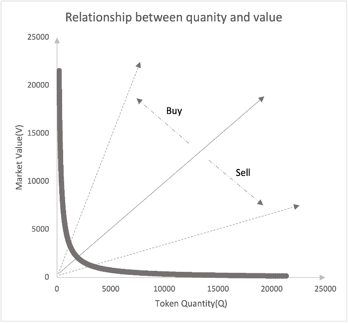
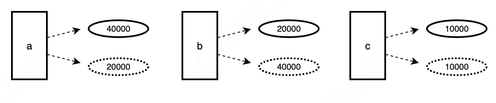
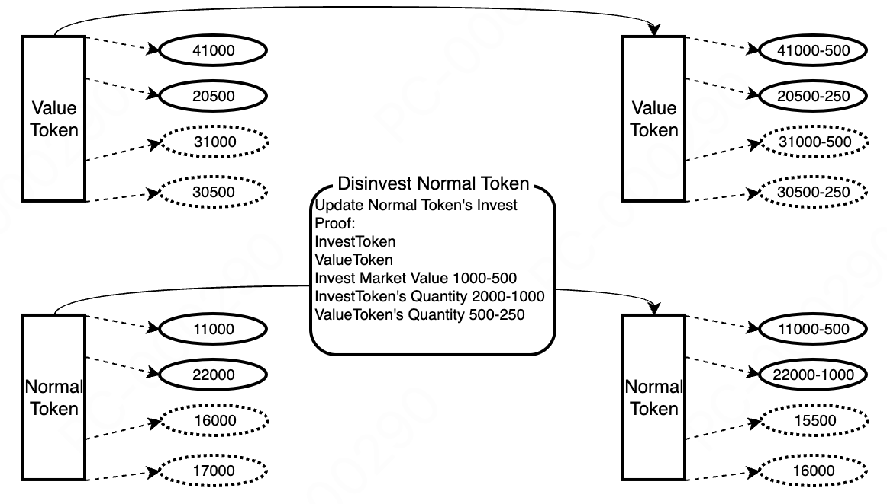
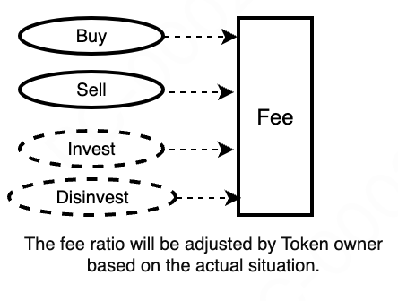
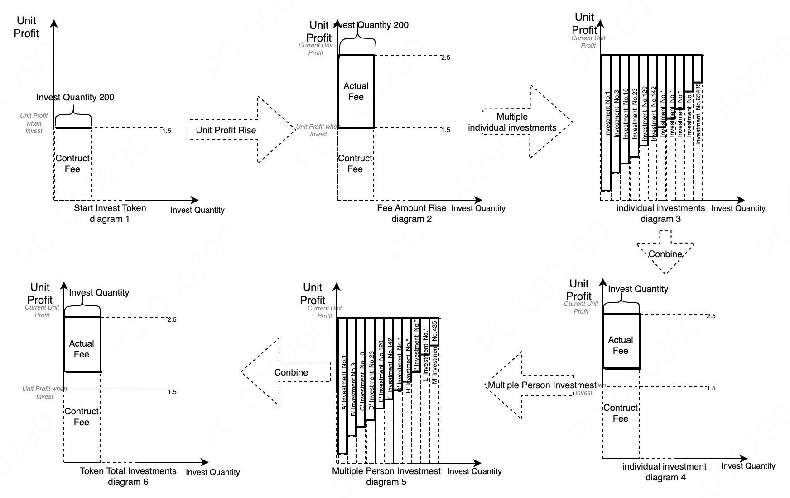

## 1 Overview  

TTSWAP (token-token swap) is an automated market-making protocol built on EVM-compatible blockchains, meaning it does not rely on centralized institutions or individuals to conduct transactions. Its core principle is to automatically trigger the transfer of market value based on user behavior, thereby creating a protocol based on a constant value trading model.  

This project's whitepaper explains the design logic of TTSWAP, covering the following aspects:  

1. Token Trading: Users can directly exchange one token for another without needing an intermediary token.  
2. Value Token Investment and Withdrawal: Users can invest in specific value tokens and withdraw their investments when needed.  
3. Regular Token Investment and Withdrawal: In addition to value tokens, users can also invest in regular tokens and withdraw their investments at any time.
4. Token Fee Generation and Distribution: Fees generated during transactions are distributed according to specific rules to incentivize more participants to join the market.  
5. Token Economic Model: Designed with the aim of safeguarding the rights and interests of all members (including regular users, marketers, service providers, community builders, etc.), the model outlines the token distribution, unlocking details, and associated rights.  

In summary, TTSWAP provides a simple, transparent, and efficient cryptocurrency trading protocol for ordinary users, using an innovative AMM logic—the constant value trading model. It aims to create a convenient, secure, and low-GAS fee protocol.  

## 2 Features

1. Constant Value Trading Model
The core idea of this model is to ensure that the value of the transaction remains constant throughout the process. This means that regardless of when the transaction occurs, it objectively reflects the market value of the tokens, allowing for free, simple, and fast token trading.

2. Direct Trading Without Intermediaries  
On this protocol, any two tokens can be traded directly without needing to convert one token into an intermediary token first. This direct trading model simplifies the transaction process, saving time and costs.

3. No Slippage Trading  
Slippage refers to the phenomenon where the transaction price deviates from expectations due to market price fluctuations during the transaction. In this protocol, as long as the transaction amount is below a specific threshold, there will be no price slippage, meaning the transaction is stable and reliable under certain conditions.

4. No Impermanent Loss  
Impermanent loss refers to the loss suffered by liquidity providers due to market fluctuations when providing liquidity. This trading model avoids the issue of impermanent loss through its design logic, meaning liquidity providers or token investors can maintain the original value of their investment when withdrawing and also earn profits from providing liquidity.

5. Low Gas Fees  
Gas fees are the costs required to execute smart contracts on the Ethereum network. Due to the relatively simple logic and low computational requirements of this trading model, Gas consumption is low, allowing users to save significant Gas fees during transactions, making trading more economical and efficient. Compared to other trading models, it can save 50% to 90% in Gas fees.

6. Fee Distribution by Role  
On the protocol, fees are distributed according to the different roles of participants, including merchants (token sellers), token investors (liquidity providers), gateways, referrals, and ordinary users. Anyone has the opportunity to participate in the protocol's operations and share the profits from the protocol's development, thereby incentivizing more users to participate in the protocol's construction.

7. Native ETH Support  
The protocol supports direct exchange of native ETH for any token.

8. Proof of Investment Secondary TTS Mining  
When users invest in tokens, the protocol automatically mines for them based on the investment value.

9. Community-Driven  
TTSWAP embraces the community, driving project improvements and refinements through community involvement.

## 3 Constant Value Trading Model Principle

### 3.1 Constant Value Trading Model

$$
\begin{align}
    {V_a\over Q_a}*Δa={V_b\over Q_b}*Δb&=...={V_z\over Q_z}*Δz  \\
    trade\ before(V_a+V_b+....+V_z)&=trade\ after(V_a+V_b+....+V_z)  \\
    V_a:Record\ token\ a's&\ market\ value  \\
    Q_a:Record\ token\ a's&\ quantity  \\
    Δa:Record\ token\ a's&\ change\ amount(buy\ or\ sell )  \\
    V_b:Record\ token\ b's&\ market\ value   \\
    Q_b:Record\ token\ b's&\ quantity  \\
    Δb:Record\ token\ b's&\ change\ amount(buy\ or\ sell )  \\
    V_z:Record\ token\ z's&\ market\ value   \\
    Q_z:Record\ token\ z's&\ quantity  \\
    Δz:Record\ token\ z's&\ change\ amount( buy\ or\ sell )   \\
\end{align}
$$

Market value measures the degree of user demand for tokens in the protocol.  
When users sell tokens, it indicates a decrease in demand for the tokens in the protocol, leading to a decrease in the token's market value.  
When users buy tokens, it indicates an increase in demand for the tokens in the protocol, leading to an increase in the token's market value.

#### 3.1.1 Calculation Logic

* State of Token~a~ and Token~b~ before the transaction  

$$
\begin{align}
    a's\ market\  value\ in\ protocol:V_a \\
    a's\ quantity\ in\ protocol:Q_a \\
    b's\ market\ value\ in\ protocol:V_b \\
    b's\ quantity\ in\ protocol:Q_b \\
\end{align}
$$
alter trading  Δa for Δb
$$
\begin{align}
    a's\ market\ value\ in\ protocol:V_a-{V_a \over Q_a}*Δa \\
    a's\ quantity\ in\ protocol:Q_b+Δb \\
    b's\ market\ value\ in\ protocol:V_a+{V_a \over Q_a}*Δa \\
    b's\ quantity\ in\ protocol:Q_b-{ {V_a \over Q_a}*Δa*Q_b \over V_b}   \\
    receive\ Δb={ {V_a \over Q_a}*Δa*Q_b \over V_b} \\
\end{align}
$$

### 3.2 Market Value of Tokens

When a token is added to the protocol, its market value is the same as its real value.  
Example: When 2000 Tokena1 is added to the protocol, its real value is 2000, so the market value of the token is 2000.  
  
Definition:
Market value V~a1~: 2000
Token quantity Q~a1~: 2000.  
Unit value P~a1~: 1, the market value per unit quantity.

### 3.3 Relationship Between Tokens in the Market and User Trading Behavior

* Example 1: a user spends 1000 to purchase Token~a~.

When a user purchases, it indicates an increase in the token's market value V. V~a1~=2000+1000=3000  
When a user purchases, the token quantity Q in the protocol decreases. Q~a1~=2000-1000=1000  
The unit value P of the token in the protocol changes to P~a1~=3  
User purchases lead to an increase in the token's unit value.  

* Example 2: a user sells 1000 to purchase Token~a~.

When a user sells, it indicates a decrease in the token's market value V. V~a2~=2000-1000=1000  
When a user sells, the token quantity Q in the protocol increases. Q~a2~=2000+1000=3000  
The unit value P of the token in the protocol changes to P~a2~=0.3333  
User sales lead to a decrease in the token's unit value.  

As shown below  


### 3.4 Relationship Between User Behavior and Token State in the Market

User sales and purchases cause changes in the token's market value V and token quantity Q, and the token's price also changes accordingly. The changes in the token's market value V and token quantity Q are shown in the figure.


### 3.5 Relationship Between Two Items in the Market

There are two tokens in the market, Token~a~ (2000,4000) and Token~b~ (4000,2000).

* A user uses 500 Token~a~, corresponding to a market value of 1000. The market value of 1000 corresponds to 1000 Token~b~.  

When a user purchases 500 Token~a~, they spend 1000 Token~b~, and the tokens in the protocol move from position a to position a1 in the figure, and from position b to position b1.  
When a user sells 500 Token~a~, they receive 1000 Token~b~, and the tokens in the protocol move from position a to position a2 in the figure, and from position b to position b2.  
  
Because the positions change, P(a) and P(b) also change, and the price of Token~b~ relative to Token~a~ changes. If there is a difference with the external market price, other transactions will promote the unification of the market price and the external market price.  
>Note: If the purchase quantity is too large relative to the market data, it will cause strong fluctuations in the relative price of the two tokens. Therefore, each transaction will be split into multiple small orders.

### 3.6 Relationship Between Multiple Tokens in the Market

Any two tokens will change positions due to user transactions, causing changes in their positions relative to other tokens and resulting in synchronized price changes.  


### 3.7 Relationship Between Token Transaction Size and Price in the Market

The token quantity in the market is 100,000,000, and the market value is 100,000,000.

 | Transaction Size | Price Change   |
 | ---------------- | -------------- |
 | 10               | 0.000000200000 |
 | 50               | 0.000001000000 |
 | 100              | 0.000002000002 |
 | 500              | 0.000010000050 |
 | 1000             | 0.000020000200 |
 | 5000             | 0.000100005000 |
 | 10000            | 0.000200020002 |
 | 50000            | 0.001000500250 |
 | 100000           | 0.002002002002 |
 | 500000           | 0.010050251256 |
 | 1000000          | 0.020202020202 |
 | 5000000          | 0.105263157895 |

### 3.8 No-Slippage Threshold (Transaction Threshold)

To avoid user transactions causing a run on the protocol's tokens, each token is initialized with a split number, and each split size is the no-slippage threshold for that token. Therefore, when a user transacts, if the transaction value is less than the token's no-slippage threshold, there will be no impermanent loss. If the transaction is larger than the token's no-slippage threshold, the transaction will be split into multiple orders based on the threshold.  
  

## 4 Tokens

### 4.1 Token Introduction

Description of the token: The protocol has 15 Token~a~ with a market value of 3000, so the token has two attributes: market value and current quantity. As shown below  


* Terminology Explanation
**Market Value**: Used to measure the degree of user demand for the protocol's tokens. If a user purchases a token, it indicates an increase in demand for that token, and thus the token's market value increases. Conversely, if a user starts selling a token, it indicates a decrease in demand for that token, and thus the token's market value decreases.
**Current Quantity**: Records the current quantity of tokens in the protocol.  

* Other tokens can be described as follows, for example  


### 4.2 Token Classification

| Token Classification | Description                                                 | Do Transactions Generate Fees | Can It Be Invested Alone | Can It Be Invested with Other Value Tokens |
| -------------------- | ----------------------------------------------------------- | ----------------------------- | ------------------------ | ------------------------------------------ |
| Meta Token           | The first token added to the market                         | Yes                           | Yes                      | No                                         |
| Value Token          | Tokens recognized by the market, with good ecology and team | Yes                           | Yes                      | No                                         |
| Regular Token        | Personally added tokens, with market value to be confirmed  | Yes                           | No                       | Yes                                        |

### 4.3 Token Configuration

Token configuration occupies 255 bits

#### 4.3.1 Adjustable by the Market

| id  | Configuration Item | Bits | Unit    | Max Value | Min Value | Start Bit | End Bit | Description    |
| --- | ------------------ | ---- | ------- | --------- | --------- | --------- | ------- | -------------- |
| 1   | Market Value Token | 1    | BOOLEAN | 1         | 0         | 1         | 1       |                |
| 2   | Reserved           | 28   | 1       | 1023      | 0         | 2         | 27      | Reserved Field |
| ... |||||||||

#### 4.3.2 Configurable by Users

| id  | Configuration Item       | Bits | Unit               | Max Value | Min Value | Start Bit | End Bit | Description         |
| --- | ------------------------ | ---- | ------------------ | --------- | --------- | --------- | ------- | ------------------- |
| 1   | Flash Loan Fee Rate      | 6    | One ten-thousandth | 63        | 0         | 28        | 33      | Flash Loan Fee Rate |
| 2   | Investment Fee Rate      | 6    | One ten-thousandth | 63        | 0         | 34        | 39      | (0~63)/10000        |
| 3   | Withdrawal Fee Rate      | 6    | One ten-thousandth | 63        | 0         | 40        | 45      | (0~63)/10000        |
| 4   | Purchase Fee Rate        | 7    | One ten-thousandth | 127       | 0         | 46        | 52      | (0~127)/10000       |
| 5   | Sale Fee Rate            | 7    | One ten-thousandth | 127       | 0         | 53        | 59      | (0~127)/10000       |
| 6   | Transaction Slice Number | 10   | 64                 | 1023      | 0         | 60        | 69      | (1~1023)X64         |
| 7   | Withdrawal Slice Number  | 10   | 1                  | 1023      | 0         | 70        | 79      | (1~1023)            |

## 5 Token Exchange  

Token exchange essentially involves users swapping their Token~a~ for Token~b~ in the market. When users choose to give up Token~a~, it indicates a decrease in the market value of Token~a~, as users no longer need it. Conversely, when users choose to purchase Token~b~, it signifies an increase in the market value of Token~b~, as users desire it.  
  

As shown in the figure, when users give up Token~a~, the quantity of Token~a~ in the protocol increases, while its market value decreases. When users acquire Token~b~, the quantity of Token~b~ in the protocol decreases, while its market value increases. This results in an increase in the price of Token~b~ relative to Token~a~. Therefore, if another transaction is conducted, the same amount of Token~a~ will yield fewer Token~b~ than before.  

### 5.1 Calculation Process

$$
\begin{align}
    {V_a\over Q_a}*Δa&={V_b\over Q_b}*Δb  \\
    before\ trading: P_{ab}&={ {V_a*Q_b} \over {Q_a*V_b}}=4 \\
    ΔB={ {V_a*Δa*Q_b} \over {Q_a*V_b}}&={ {40000*2500*40000} \over {20000*20000}}=10000 \\
    V_a=V_a-{V_a\over Q_a}*Δa&=40000-{40000\over 20000}*2500=35000\\
    Q_a=Q_a+Δa&=20000+2500=22500 \\
    V_b=V_b+{V_b\over Q_b}*ΔB&=20000+{20000\over 40000}*10000=25000\\
    Q_b=Q_b+ΔB&=40000-10000=30000 \\
    after\ trading: P_{ab}&={ {V_a*Q_b} \over {Q_a*V_b}}=1.86666 \\
\end{align}
$$

## 6 Token Investment and Withdrawal

### 6.1 Recording Investment and Withdrawal

Token transactions in the market require users to provide liquidity. Therefore, the total market value and total quantity of token investments must be recorded.  
  

* Terminology Explanation  
Investment Value: The total market value of tokens at the time of user investment.  
Investment Quantity: The total quantity of tokens at the time of user investment.  

### 6.2 Value Token Investment and Withdrawal Process

  

* User Investment in Value Tokens  
  Users calculate the market value corresponding to the investment quantity based on the current state of the value token. This facilitates profit calculation during withdrawal.  

* User Withdrawal of Value Tokens  
  Users calculate the profits generated from the investment based on the investment records.  

> When withdrawing tokens, the withdrawal quantity must be less than the total token quantity divided by the withdrawal slice number, and the market value corresponding to the withdrawal quantity must be less than the total token value divided by the withdrawal slice number.  

### 6.3 Regular Token Investment  

  

* User Investment in Regular Tokens  
  Due to the high volatility of regular tokens' market value, arbitrage within the protocol may occur, leading to losses for token investors. To prevent this, investments must be made in value tokens of equivalent market value. Both the invested value tokens and regular tokens generate investment returns. Refer to the fee distribution section for details.  

### 6.4 Regular Token Withdrawal  

  

* User Withdrawal of Regular Tokens  
  Based on the investment records, calculate the profits from regular tokens and invested tokens. Refer to the fee distribution section for details.  
  When withdrawing tokens, the withdrawal quantity or the market value corresponding to the withdrawal quantity must be less than the total token quantity or total value divided by the maximum withdrawal ratio.  

## 7 Token Fees  

Fees are generated when users conduct transactions or make investments. These fees are stored in a pool and distributed when users remove liquidity.  

### 7.1 Token Fee Recording Method  

  

* Terminology Explanation  
  Total Fees = Actual Fees Generated + Constructed Fees  
  Constructed Fees = Virtual fees introduced to calculate user investment profits, not actual fees. Refer to sections 7.4 and 7.5 for details.  

### 7.2 Fee Sources  

  
Fees (actual fees) are generated based on the token's fee rate when users perform operations.  

### 7.3 Fee Distribution  

  
The protocol involves protocol technology, gateway operations, referrals, users, and liquidity providers. The protocol will distribute profits fairly.  
The fee distribution for liquidity providers is detailed in sections 7.4 and 7.5.  

* If the user has a referral:  
  Fees are distributed in real-time based on the user's relevant roles.  

* If the user does not have a referral:  
  The user's share of the fee distribution is allocated to the token administrator.  
  The referral's share of the fee distribution is allocated to the gateway role.  

### 7.4 Fee Calculation Process (Investment)  

  

* Figure 1: Token State Before User Investment  
  Unit Fee refers to the fee per unit of investment. Unit Fee = Total Fees / Total Investment Quantity.  
  As transactions proceed, fees are continuously generated, increasing the total fees and unit fees.  
  Constructed Fees represent the total fees that the user should not enjoy at the time of investment.  
  Constructed Fees = Investment Quantity * Unit Fee at the Time of Investment.  

* Figure 2: Fee Accumulation After User Investment  
  As fees are continuously generated in the protocol, unit fees keep increasing.  
  User Investment Profit = Unit Fee * Investment Quantity - Constructed Fees.  

* Figure 3: Multiple Investments by a User on a Token  
  When a user makes multiple investments on the same token, they can be consolidated into a single investment record.  
  Consolidated Constructed Fees = Sum of Constructed Fees Before Consolidation.  
  User Investment Profit = Unit Fee * Investment Quantity - Consolidated Constructed Fees.  

* Figure 4: Consolidation of Multiple Investments by a User on a Token  
  This figure shows the consolidated investment status.  

* Figure 5: Multiple Users Investing in a Token  
  When multiple users invest, the total investment quantity, total market value, and total constructed fees for the token are aggregated.  
  The total actual investment profit for the token = Total Current Fees - Total Constructed Fees.  

* Figure 6: Consolidation of Multiple Users' Investments in a Token  

### 7.5 Fee Calculation Process (Withdrawal)  

  

* Figure 1: Individual Token Investment (This figure represents no impermanent loss when providing liquidity)  
  This figure shows an individual's investment in a token. When a user withdraws, the calculation logic is as follows:  
  Current Unit Fee of the Token = Total Current Fees of the Token / Total Current Investment Quantity of the Token.  
  Constructed Fees at Withdrawal = Constructed Fees*(Withdrawal Quantity / Total User Investment Quantity).  
  When a user withdraws, the profit obtained = Current Unit Fee*Withdrawal Quantity - Constructed Fees at Withdrawal.  

* Figure 2: Total Token Investment  
  The calculation logic for the token after user withdrawal:  
  Total Current Fees of the Token = Original Total Current Fees of the Token - User Profit at Withdrawal - Constructed Fees at Withdrawal.  
  Constructed Fees of the Token = Original Constructed Fees of the Token - Constructed Fees at Withdrawal.  
  Investment Quantity of the Token = Original Investment Quantity of the Token - User Withdrawal Quantity.  

### 7.6 Token benefits  

Project parties or sellers can deposit tokens into the fee pool to increase investment annualization and enhance investment attractiveness.  
  

## 8 Market Configuration  

| id  | Configuration Item        | Bits | Unit        | Max Value | Min Value | Start Bit | End Bit | Description |
| --- | ------------------------- | ---- | ----------- | --------- | --------- | --------- | ------- | ----------- |
| 1   | Token Investor Commission | 6    | One percent | 63        | 0         | 256       | 251     |             |
| 2   | Merchant Commission       | 6    | One percent | 63        | 0         | 250       | 245     |             |
| 3   | Gateway Commission        | 6    | One percent | 63        | 0         | 244       | 239     |             |
| 4   | Referral Commission       | 6    | One percent | 63        | 0         | 238       | 233     |             |
| 5   | User Commission           | 6    | One percent | 63        | 0         | 232       | 227     |             |
| 6   | Protocol Fee Rate         | 6    | One percent | 63        | 0         | 226       | 221     |             |
| ... |                           |      |             |           |           |           |         |             |

## 9 Main Code Implementation (Refer to Code)  

### 9.1 Contract Deployment GAS

| Deployment Cost | Deployment Size |
| --------------- | --------------- |
| 5644297         | 26543           |

### 9.2 Contract Functions (Partial Main Functions) GAS  

| Function Name  | First  | second or more  | Remarks                                  |
| -------------- | ------ | ------  | ---------------------------------------- |
| buyGood        | 104056 | 86942   | Purchase Token                           |
| disinvestProof | 255412 | 198512  | Withdraw Regular Proof                   |
| disinvestProof | 176765 | 129300  | Withdraw Value Proof                     |
| initGood       | 399488 |        | Initialize Regular Token                 |
| investGood     | 172331 | 114339  | Invest in Regular Token                  |
| investGood     | 242021 | 114414  | Invest in Value Token                    |
| collectProof   | 238070 | 80158  | Collect Regular Investment Proof Profits |
| collectProof   | 140453 | 103453  | Collect Value Investment Proof Profits   |
| warefare       | 69462  | 52362  | Add Fees for Benefits                    |

When a user transacts with a token for the first time, GAS consumption is at the MEDIAN level. For the second or subsequent transactions with the same token, GAS consumption is generally at the MIN level.

To promote better project growth and protect the interests of project supporters, the following token plan is introduced.  

## 10 Roles in the Protocol  

The protocol supports five roles: Token administrator, Token Liquidity Provider, Service Provider, Referral, User, and Platform.  

### 10.1 Token Administrator  

When a user adds a token to the platform for the first time, they become the token's administrator, equivalent to being entrusted by the community to manage the token. They enjoy a commission of 1%-3% of the fees. Tokens not directly operated by the project are evaluated every two years.  

### 10.2 Token Liquidity Provider  

When a user provides liquidity for a token, they automatically become a liquidity provider for that token and share a commission of 50%-80% of the fees. The calculation method is detailed in the fee calculation logic section.  

### 10.3 Service Provider  

Service providers offer trading, investment, and other services to users and can enjoy a commission of 5% to 25% of the fees.  

### 10.4 Referral  

When a user refers other users, they can enjoy a commission of 5%-10% of the fees from the referred users.  

### 10.5 User  

When a user adds a referral, they enjoy a 10% discount on fees.  

### 10.6 Community  

The community provides technical support and can enjoy a commission of 2%-8% of the fees.  

## 11 Token Economic Plan  

1. Initial token issuance: <font size=5>50 million tokens</font> (<font color='red'>all in a locked state, requiring conditions to be met for unlocking</font>).  
2. Annual addition: (200 million - number of unfrozen tokens) * 0.02 to liquidity providers.  
3. All community earnings are used to purchase official tokens on the market for burning. They are prohibited from being used for other purposes.  
4. The earnings of community builders, operators, and supporters come from the increase in token value, not through dilution, over-issuance, or other means.  
5. Any changes to the community allocation of tokens must be announced at least 30 days in advance.  
6. Token holders have the right to propose and vote on proposals, participating in the growth and development of the community.  
7. Referral relationships are maintained within this token, and once confirmed, they cannot be modified. All future versions of this project will use this referral relationship.  

### 11.1 Initial Token Allocation Principles  

Allocations must be configured with an unlocking ratio (not exceeding 20%) and an initial price (not lower than the current price). When the price doubles, users can unfreeze the remaining portion*unlocking ratio.  
For example, if user A is allocated 20,000 tokens with an unlocking ratio of 18%, and the allocation price is 0.05, then 20,000*0.18 tokens can be unfrozen when the price reaches 0.05. When the price reaches 0.1, 20,000*0.18*0.18 tokens can be unfrozen.  

### 11.2 4C Growth Community Token Economic Model  

The 4C Growth Community Token roles are divided into four categories: Founders, Partners, Value Contributors, and Capital Contributors.  

#### 11.2.1 Founder Portion  

The Founder portion is for the project initiators who provide significant human capital to develop the product, establish the brand, expand the market, recruit talent, and build the management system, while bearing substantial failure risks and enjoying the benefits. (Initial price is 0.05, price doubles, unlocking ratio is 1/10).  

#### 11.2.2 Partner Portion  

The Partner portion is for members who, during the initial stages of the project, utilize their team's strong execution capabilities to overcome various difficulties, persist, and firmly believe in growing the community together.  

1. Partner Portion Type A  
   The initial price is confirmed upon member joining. When the token price doubles, the remaining portion is unlocked at a ratio of 1/8. The ununlocked portion is not burned if the member leaves the community.  

1. Partner Portion Type B  
   The initial price is confirmed upon member joining. When the token price doubles, the remaining portion is unlocked at a ratio of 1/6. The ununlocked portion is burned if the member leaves the community.  

#### 11.2.3 Value Contribution  

The community provides token pre-allocation incentives for members contributing to community building. The initial price is the allocation price, and the unlocking ratio does not exceed 1/5 when the price doubles. Specific agreements and announcements will be made with relevant personnel. The allocated but ununlocked portion may be adjusted by the community based on achieved results. When a member no longer serves the community, the allocated but ununlocked portion will be reclaimed by the community.  

1. Community Position Portion:  
   The position portion is determined by the importance of the roles within the community. This portion is allocated to the responsible persons of important positions, with the corresponding ratio determined by the community at the beginning of each year. The community may convert a certain portion to Partner Type A or Partner Type B for qualified and excellent responsible persons through community decision-making.  

1. Community Member Portion:  
   This portion is reserved to incentivize members to grow with the community. The community may convert a certain portion to Partner Type B for outstanding members through community decision-making.  

1. Other Portions:  
   Used for treasury, operations, activities, advisors, etc.  

#### 11.2.4 Capital Contribution  

1. Public Sale Portion (refer to the public sale plan):  
   Provides financial support for team building, product development, and liquidity building. (The public sale portion is fully unlocked and not locked).  

1. Investment Portion:  
   Provides financial support for team improvement and product refinement. The initial price and unlocking ratio will be determined through communication.  

1. Airdrop Portion:  
   Compensates for the risks taken by early protocol users. The initial price and unlocking ratio will be determined based on specific event plans.  

### 11.3 4C Growth Community Token Allocation Detailed Design  

  

## 12 Legal Permissions  

### 12.1 Explanation  

To protect the project's rights and facilitate user understanding of the protocol, different files have different open-source licenses. Violations of the license will be legally pursued.  

### 12.2 Protocol Explanation  

Files using the MIT license are freely available for use.  
Files using the BUSL-1.1 license can only be used for learning purposes during the protocol's validity period and cannot be used for commercial purposes. For specific license details, refer to:  
[LICENSE file in the project](https://github.com/tt-swap/ttswap-core/blob/529db0eb94ac1c5631beb03c4697222a6ce1cd79/LICENSE): https://github.com/tt-swap/ttswap-core/blob/529db0eb94ac1c5631beb03c4697222a6ce1cd79/LICENSE.  
If the project unintentionally violates other projects' open-source licenses, please contact us, and we will make adjustments promptly.  

### 12.3 File Open-Source License Information  

```markdown
Contract
├── TTSwap_Market.sol(BUSL-1.1)  
├── TTSwap_Token.sol(BUSL-1.1)
├── TTSwap_StakeETH.sol(BUSL-1.1)
├── interfaces  
│   ├── I_TTSwap_Market.sol(MIT)   
│   ├── I_TTSwap_Token.sol(MIT)   
│   └── I_TTSwap_StakeETH.sol(MIT)    
└── libraries           
   ├── L_Currency_Stake.sol (MIT)    
   ├── L_Currency.sol (MIT)    
   ├── L_Error.sol (MIT)     
   ├── L_Good.sol(BUSL-1.1)    
   ├── L_GoodConfig.sol(MIT)     
   ├── L_MarketConfig.sol(MIT)    
   ├── L_Proof.sol(BUSL-1.1)     
   ├── L_SignatureVerification.sol(MIT)   
   ├── L_Transient_Stake.sol (MIT)  
   ├── L_Transient.sol (MIT)  
   ├── L_TTSTokenConfig.sol (MIT)     
   ├── L_TTSwapUINT256.sol (MIT)     
   └── L_UserConfig.sol(MIT)    
docs
├── ebook
├── whitepaper-cn
│   └──whitepaper-cn.pdf(BUSL-1.1)
└── whitepaper-en
    └──whitepaper-en.pdf(BUSL-1.1)
tests

```


## 13 Participation and Collaboration Contact Information  

Twitter:[ttswapfinance](https://x.com/ttswapfinance)  
Telegram:[@ttswapfinance](https://t.me/ttswapfinance)  
Email:[ttswapfinance@gmail.com](mailto:ttswapfinance@gmail.com)  
Discord:[ttswap](https://discord.gg/XygqnmQgX3)  
Website:[ttswap.io](http://www.ttswap.io)  
Github:[ttswap](http://github.com/ttswap)  

We welcome talents from all regions to join the community.