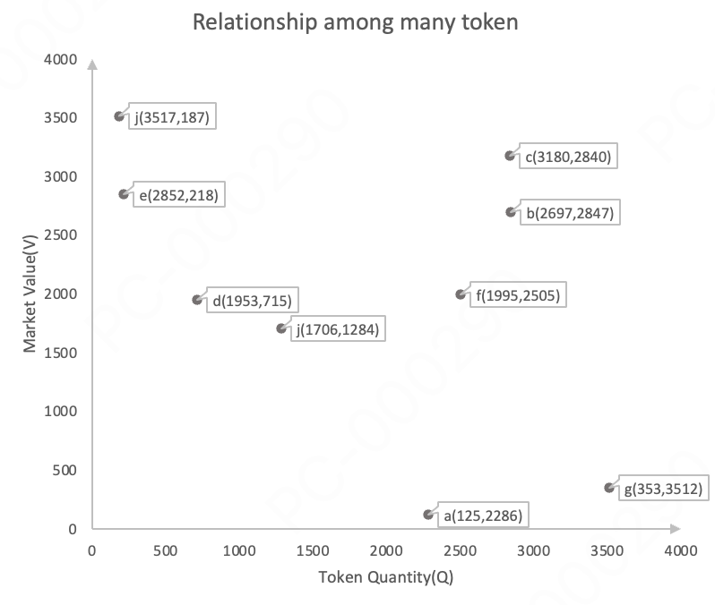

# User document
This documentation provides users with an understanding of TTSWAP's operational mechanics, design rationale, and implementation guidelines.
## ✅ I. What is TTSWAP?
TTSWAP is a decentralized token trading platform where anyone can quickly and safely exchange one token for another without relying on centralized exchanges.
It operates entirely through smart contracts, eliminating intermediaries, with prices automatically determined by protocol trading. This innovative mechanism is called the "Constant Value Trading Protocol," making the trading process more transparent, fair, and stable.

### 💪 What Can You Do on TTSWAP?
1. **Freely Exchange Any Token**  
No need for intermediate tokens (like USDT), you can directly exchange Token A for Token B - simple, fast, and slippage-free.
2. **Provide Risk-Free Liquidity, Earn Returns**  
If you're bullish on a token, you can deposit it into the protocol to earn fee rebates and platform token mining rewards; withdraw anytime without loss.
3. **Provide Liquidity to TTSWAP, Secondary Mining of TTS Tokens**  
Provide liquidity to TTSWAP, enjoy secondary mining of TTS, participate in early project development, and receive higher returns.
4. **Refer New Users to TTSWAP, Permanently Enjoy Fee Sharing**  
Referral relationships are stored in the token contract, unbreakable and unchangeable, ensuring permanent fee sharing.
5. **Operate Tokens in TTSWAP, Enjoy Token Trading Dividends**  
Add tokens to the protocol, become a token operator, and enjoy fee sharing from that token's trading.
6. **Create Your Own Portal Through TTSWAP, Provide Convenience for Users**  
Provide high-quality, high-standard services for your large private domain traffic, earning service revenue.
7. **Integrate TTSWAP to Create Your Own Application, Expand TTSWAP Ecosystem**  
TTSWAP is an open community, allowing developers to integrate it into their applications, expanding the TTSWAP ecosystem.
8. **Hold TTS Tokens, Enjoy Community Growth Benefits**  
TTS tokens are goal-oriented deflationary tokens. Besides market purchases, public sales, and liquidity mining, tokens obtained through other means can only be unlocked when the price increases. Meanwhile, community profits are used for token burning, protecting token holders' rights.
Token holders also have proposal rights, voting rights, and community supervision rights.

---
### 📘 Summary
TTSWAP is committed to building a Web3 token exchange platform that is:
- Low transaction costs
- No intermediaries
- Fair, open, and transparent
- Encouraging win-win cooperation

## ✅ II. Why Choose TTSWAP?
TTSWAP not only allows you to conveniently and safely exchange tokens but also offers these 10 advantages, making every transaction more efficient and cost-effective.

### 🌐 1. Stable Prices, No Slippage Worries  
In TTSWAP, small transactions won't result in "losses" due to price fluctuations - what you estimate is what you get, making trading more controllable.

### 💧 2. All Tokens Share Liquidity, More Freedom in Trading  
You no longer need to establish trading pairs one by one, nor worry about "insufficient liquidity in small pools." TTSWAP allows all pairs of the same token to share a **super pool**, making trading faster and smoother.

### 🛡️ 3. No Impermanent Loss, LP Providers Feel Secure  
On other platforms, providing liquidity can lead to losses due to price fluctuations, known as **impermanent loss**. TTSWAP's mechanism effectively avoids this issue, ensuring your investment doesn't decrease.

### ⛽ 4. 50%-90% Gas Fee Savings  
Streamlined smart contract structure and optimized calculation logic make every transaction **more economical** than traditional platforms - the gas savings are visible.

### 🔁 5. Direct ETH Support, Eliminating Hassle  
You can trade directly with ETH without first converting to WETH (wrapped ETH), making it more convenient in one step.

### 💰 6. Every Investment Can Mine (TTS)  
When you invest tokens, the system automatically calculates and starts **secondary mining** based on your invested value, earning additional TTS rewards.

### 🌱 7. Investment Returns Can Stack with ETH Staking Rewards  
After depositing ETH into the SETH/SWETH pool, the system automatically stakes unused funds in Rocketpool, enjoying an additional **3-5% annual return**.

### 📊 8. Everyone Can Participate, Fees Automatically Distributed by Role  
Are you a user, referral, portal, liquidity provider, or token operator? Everyone gets a certain percentage of fee sharing, **everyone can participate**.

### 🧱 9. Modular, Flexible Configuration, Easy Integration  
Simple protocol interface, convenient calls, while each token's parameters, fees, and mining ratios can be **flexibly set**, providing more freedom for project parties and developers.

### 💎 10. TTS Token is a Goal-Oriented Deflationary Token  
TTS has a fixed total supply, all initially locked, **unlocked only when price increases**. Community profits are used for token burning, shared by token holders.

### 👥 11. Community-Driven, User-Led Future  
TTSWAP doesn't belong to any company, it belongs to the community. **Project development direction and reward mechanisms are driven by community consensus.**

## ✅ III. What's the Operating Logic Behind It?

### 🧠 1. Explained in One Sentence  
TTSWAP's core mechanism is called the **Constant Value Model**, also known as the Multi-Asset Dynamic Balance Model. It ensures that during each token exchange, the "total market value" of both sides is equal. Trading is like a balance scale - **you give how much value, you get back equal value in another token**.

### 📊 2. Analogy Explanation  
Imagine going to a fruit market with $10 to buy apples:
- If apples are expensive at $10 per pound, you can only buy 1 pound.
- If apples are cheap at $5 per pound, you can buy 2 pounds.

TTSWAP operates similarly. The difference is that it doesn't use fiat currency pricing but automatically calculates exchange rates based on **existing token quantities and values in the market**.
The system uses the following formula to keep prices fair as supply and demand change.

---
### ⚖️ 3. Compute the input token value  

$$
ΔV = \frac{V_a}{Q_a + {{Δa}\over 2}} \cdot Δa \\
$$

---
### 🔄 4. How is the Exchange Rate Calculated?  
The system determines how much A you need to exchange for B based on:
- The quantity of each token in the pool
- The current market value of each token  
$$
Δb = \frac{Q_b}{V_b + {{ΔV}\over 2}} \cdot ΔV \\
$$

---
### 📐 5. What are "No Slippage" and "Trading Threshold"?  
In TTSWAP, if your transaction amount is below **a certain threshold**, the system won't batch match orders but execute at the current price in one go.
This avoids "slippage" (where you thought you could buy 10 but only got 9).

---
### 🔄 6. Visual Trading Process  
- How price P changes with buying and selling

P changes with trading behavior  
- [Figure 2] Why Total Value Remains Constant

The value lost by one token transfers to another, as total value remains unchanged  
- [Figure 3] How Multiple Tokens Interact to Affect Prices

When one token's P changes, its relative relationship with other tokens also changes 

---

## ✅ IV. How to Invest in Tokens and Earn Returns?
On TTSWAP, you can not only trade tokens but also "deposit to earn returns." The platform rewards you with fee sharing + TTS mining rewards based on your token deposits.

---
### 🔹 1. Each Token Has Two Core Attributes:
- Market Value: What the market currently thinks this token is worth
- Quantity: How many of this token are in the pool  

> 💡 These two data points determine how much return users can earn after investing and the exchange rate.

---
### 🧩 2. Tokens Are Divided into Three Categories, Choose Your Participation Method:  

| Token Type | What is it | What can you do | Fee Returns | Supports Solo Investment |
| --------- | ---------------------  | ------------------ | ------ |  ------ | 
| 🌱 Meta Token | First token added to protocol | Serves as liquidity base |✅ Yes |✅ Yes |
| 🌟 Value Token | Market-recognized tokens with ecosystem support (like ETH) | Independent investment, independent earnings |✅ Yes | ✅ Yes |
| 📦 Regular Token | User-added tokens, pending market validation | Must be invested alongside Value Tokens | ✅ Yes | ❌ No |

---
### 💡 3. How to Invest?
1. Choose the token you want to support
2. Deposit a certain amount of that token (if it's a Regular Token, you need to deposit an equivalent amount of Value Token)
3. Wait for returns: You'll receive:
  - Fee sharing from each transaction
  - TTS tokens from liquidity mining

---
### 📤 4. How to Withdraw?   
You can withdraw your invested tokens anytime, and the system will distribute accumulated returns based on your investment time and proportion.    
> ⚠️ To prevent sudden large withdrawals from affecting the system, single withdrawals cannot exceed a certain percentage of the current pool (known as "withdrawal slice" limit).

---
### 🛡️ 5. Why Must Regular Tokens Be Paired with Value Tokens?  
Because Regular Tokens have high price volatility and are susceptible to arbitrage. To protect investors, the system requires:
- When investing Regular Tokens, you must pair with an equivalent amount of "Value Token"
- These two types of tokens record returns separately, and you can view and withdraw them separately

---
### 💵 6. Investment Process Diagram
1. You select a token and input quantity
2. System calculates corresponding investment value based on market value
3. Successful investment, start accumulating returns (fees + TTS)

## ✅ V. How Do You Exchange Token for Token?
TTSWAP allows you to exchange one token (like A) for another (like B) anytime, with the trading process independent of intermediaries and no need to wait for order matching.

---
### 🔁 1. Exchange Logic: Using "Market Value" Instead of Fixed Prices  

Each token has:  

- Current quantity in pool (how many A, how many B)  
- Current market value (is this token popular? Are people buying it?) 

The system completes transactions based on "market value of token given = market value of token received."   
**Example:**     
>You exchange 2500 A for B, the system calculates how much 2500 A is worth (say $100), then checks B's current unit price (say 1 B = $0.01), and gives you 10,000 B.

---

### 📉 2. Why Does Price Increase with More Purchases?  

Each exchange changes the pool's state:

- Given token quantity **increases** → its market value **decreases**
- Received token quantity **decreases** → its market value **increases**

So next time you exchange, the same amount of A might not get you as many B.  
> 💡 Analogy: Like when you buy more of a fruit, the vendor thinks it's in high demand and raises the price.

---

### 📊 3. Real-time Price Calculation Illustration  

The system actually executes this formula:  
$$
\begin{align}
   ΔV = \frac{V_a}{Q_a + {{Δa}\over 2}} \cdot Δa \\
Δb = \frac{Q_b}{V_b + {{ΔV}\over 2}} \cdot ΔV \\
\end{align}
$$
 
You don't need to memorize this! Just know it ensures fair exchanges without black-box pricing.

---
### ⛽ 4. Does Price Change After Every Transaction?   

Yes, but **the system splits large transactions into multiple small ones**, preventing sudden price spikes or drops, avoiding slippage losses.  
This is the core logic behind TTSWAP's "slippage-free trading":  
As long as your transaction amount doesn't exceed a certain **threshold** (system-set "slice value"), each transaction executes at a stable price.

---
**📘 Additional Notes:**  
- All transactions are automatically calculated on-chain, public, transparent, and verifiable
- No need to wait for order matching, no "failed orders"
- No "bot front-running," your transactions are processed in real-time according to rules

---

## ✅ VI. How to Invest, Earn, and Withdraw?

On TTSWAP, besides trading tokens, you can **earn fees and TTS token rewards through "investing."** It's like depositing money in a bank, but you get both interest and additional dividends.  

---

### 💡 1. What is "Investing"?

Investing = depositing your tokens into the platform's pool for other users to trade with, while earning returns.
The more you deposit and the longer you hold, the more you earn.
The system records two core data points:

- 📈 Market value at investment time
- 📦 Amount of tokens deposited

---

### 📌 2. Two Types of Investment

|Investment Type| Description | Return Source | Requires Pairing |
|----------|----------|--------|----|
|🌟 Value Token Investment | Deposit mainstream tokens like ETH | Fee sharing + TTS mining | No |
|🔍 Regular Token Investment | Deposit new project tokens | Fee sharing + TTS mining | ✅ Requires Value Token pairing |

---

### 💰 3. How to Earn Returns After Investing?

The system continuously records fees generated from trading and distributes them according to your investment proportion.  
You also receive platform tokens TTS as mining rewards.  
> ✅ Example: If you invested 10% of the ETH pool share, you'll receive 10% of the fees and rewards generated by this pool.

---

### ⛏️ 4. What is "Construction Fee"?  

To ensure fairness, the system records the **construction fee** (= deposit amount * (total fees/total deposit amount)) corresponding to your investment time, which doesn't count as your profit.  
Only fees generated after your deposit count as your profit.

---

### 💼 5. How to Withdraw? Can You Withdraw Anytime?

You can withdraw anytime, and the system will calculate your returns based on your investment proportion and historical data, automatically distributing them.
⚠️ Note:
> Single withdrawals cannot be too large (system sets maximum withdrawal proportion) to avoid affecting overall market stability.

---

**💡 Special Note for Regular Token Investment:**
- Because Regular Tokens are more volatile, to prevent arbitrage
- The system requires you to simultaneously deposit an equivalent amount of "Value Token" (like ETH)
- The more you deposit and the longer you hold, the more returns you earn on both sides
- If the regular token price goes to zero, the corresponding value token cannot be withdrawn

---

### 📌 6. Investment Diagram

1. Set deposit amount
2. Calculate required equivalent token deposit amount based on deposit amount
3. Record investment time quantities and market values of both tokens, and corresponding construction fees
4. Record investment time construction fees for both tokens

---

### 💵 7. Withdrawal Diagram

  

1. Set withdrawal amount
2. Calculate required equivalent token withdrawal amount based on withdrawal amount
3. Calculate investment time quantities and market values of both tokens
4. Calculate current fees and returns for both tokens

## ✅ VII. How Are Fees Earned? How Does the Platform Distribute Money?
On TTSWAP, every transaction and investment generates fees. These aren't kept by the platform but automatically distributed to different participants by the system - just participate, and you have a chance to earn!

---
### 💸 1. Where Do Fees Come From?
Whenever someone:
- Makes a transaction (exchanges tokens)
- Invests tokens
- Withdraws
The system deducts a portion as fees according to a certain ratio.

---
### 📊 2. How Are Fees Distributed?  
Fees aren't monopolized by the platform but reasonably distributed based on your role in the protocol:  
| Role | Fee Distribution Ratio (Example) |
| --------- | --------------------- |
| 💧 Liquidity Provider | 50%~80% (distributed by investment proportion) |
| 🧑‍💼 Service Provider/Portal | 5%~25% |
| 👤 Referral | 5%~10% |
| 🧑‍🤝‍🧑 User | Exclusive 10% discount or reward |
| 🛠️ Token Administrator | 1%~3% sharing |     
| 🌐 Community and Protocol | Used for buyback/burning/development funds etc. |
>💡 The system automatically adjusts these ratios based on conditions like whether a referral is filled in or if a portal is used, ensuring fairness and transparency.  

---
### 🧮 3. How Are Investor Fees Calculated?
Key terms: unit fee, construction fee
After you invest, the system records:
- What's the current total fee?
- What's your deposit amount?  
 
As others continue trading, system fees increase, generating profit for your portion.  
Return formula:  
$$
\begin{align}
Return\ =\ Current\ Unit\ Fee\ ×\ Your\ Investment\ Amount\ -\ Construction\ Fee  
\end{align}
$$

> 💡 Construction fee is your share of "historical fees" at investment time, not counted in your returns, ensuring fairness.

---
### 📈 4. Can Multiple Investments Merge Returns?  
Of course! The system automatically merges your multiple investments in the same pool, calculating and distributing all returns uniformly, no manual operation needed.

---
### 💼 5. Are Returns Automatically Distributed Upon Withdrawal?
Yes. When you withdraw your investment:
- The system calculates your fee returns in real-time
- Then sends you "principal + returns" in one go
And automatically deducts your share from the pool, updating system status.

---
### 🧧 6. Can Fees Be Distributed as Benefits?
Yes, project parties or token issuers can actively deposit some tokens into the fee pool to:
- Increase annual returns, attract more investors
- Incentivize liquidity providers
- Hold promotional activities

---
### 📚 7. Flow Chart Explanation   

- Figure 1: How fees accumulate after investment
- Figure 2: How returns are settled upon withdrawal
- Figure 3: How multiple investments are merged and calculated
- Figure 4: Referral/service provider fee path diagram

---

## ✅ VIII. What is Liquidity Mining? The More You Participate, The More You Mine!
Liquidity mining = You deposit tokens → Protocol calculates your "value" contribution → Distributes platform tokens (TTS) as rewards.

---
### ⛏️ 1. What is "Secondary Mining"?  
On TTSWAP, every time you invest tokens or provide liquidity, you not only earn fees but also automatically participate in mining platform tokens TTS.  
This is called "secondary mining," an additional reward.    
> TTS is the platform's governance/incentive token, which can be used for voting, participating in profit sharing, trading, etc. in the future.

---
### 💧 2. Who Can Participate in Mining?  
As long as you deposit tokens (any token) into the platform pool, **the system calculates your computing power based on your "market value" investment**, thus earning TTS rewards.  
|What you do| Reward situation|
| ------------ | ------- |
|Deposit ETH and other tokens |✅ Start mining TTS|
|Deposit regular tokens |✅ Can also mine (requires Value Token pairing)|
|Earlier investment |✅ More rewards|
|More investment |✅ Higher rewards|

---
### 📊 3. What are the Reward Rules?  
- Daily distribution of **((200 million - unlocked amount) * 2%/366 days)**
- The system determines how much you can mine based on your current computing power (invested market value) proportion of total computing power

**Example:**  
Total network investment is 1000 USDT, you invested 100, so you currently have 10% computing power.  
If the system distributes 1000 TTS, you'll get 100 TTS.

---
### 🧠 4. No Additional Operations? Completely Automatic?
Yes, you only need to:
- Deposit tokens into the pool
- Leave the rest to smart contracts
The system automatically:
- Distributes fee rebates
- Accumulates TTS mining rewards
- You can check & withdraw anytime

---
### 🎁 5. What Can Mined TTS Be Used For?  
- Can be used for platform governance and voting
- Can be sold for other tokens
- Can participate in future ecosystem incentive activities
- Future plans support "staking for value increase" and more features

---
### 📚 6. Diagram Explanation 
- Figure 1: User deposits Token into pool
- Figure 2: System converts to computing power based on market value
- Figure 3: TTS continuously accumulates, can be claimed

---
### 📘 7. Summary  
**Liquidity mining = Deposit tokens → Accumulate returns + Mine platform tokens + Zero operation threshold**  
**Like "wealth management + mining machine + automatic ATM" three-in-one**

## ✅ IX. Stake ETH Once, Earn Five Returns - How?
Are you holding ETH? On TTSWAP, with just one stake, the system automatically opens **five return channels** for your **ETH**, no more "idle lying flat."

---
### 💰 1. One Stake, Five Returns
| Return Source | Description|
| ----------| ------------------------------------ |
|① Fee Rebates | As a liquidity provider, enjoy fee sharing from transactions |
|② TTS Mining Rewards | System distributes platform token TTS rewards based on your ETH value |
|③ Validator Rewards | System stakes unused ETH liquidity in Rocketpool, earning validation rewards (about 3~5% annual) |
|④ rETH Pool Rebates | Received rETH automatically joins rETH pool, continuing to generate fee rebates |
|⑤ rETH Re-mining Returns | Continue participating in TTS mining in rETH pool, returns compound like a snowball |

---
### 🧠 2. Entire Process Automatic, No Operation Needed
You only need to do one thing:    
**Deposit ETH or WETH into corresponding pool (SETH or SWETH)**  

The system automatically completes:
- **Rocketpool staking (obtaining rETH)**
- **Re-staking rETH (obtaining more rebates and rewards)**
- **Managing return distribution**

---
### 🧪 3. Why Higher Returns Than Regular Staking?     
Traditional ETH staking only gets 3%~5% validator annual returns.  
TTSWAP achieves return stacking effects through **combined pool design + automatic compound interest**, **far exceeding single staking return models**.

---
### 🔗 4. What is This Mechanism Based On?
- Rocketpool: Decentralized ETH staking protocol
- rETH: Staking certificate issued by Rocketpool (including returns)
- SETH / SWETH: TTSWAP internal ETH/WETH mapping tokens, supporting user participation and tracking

---
### 📚 5. Secondary Staking Process Diagram
 
a. User deposits ETH → SETH pool  
b. User receives SETH pool fee sharing  
c. User receives SETH pool liquidity mining TTS  
d. Unused portion in SETH → Rocketpool staking   
e. User receives validator returns  
f. Receive rETH → Deposit into rETH pool  
g. User receives rETH pool fee sharing  
h. User receives rETH pool liquidity mining TTS  

**User simultaneously receives five returns:**  
**- SETH pool fees + SETH pool mining + validation rewards + rETH pool fees + rETH pool mining**

---
### 📘 6. Summary  
This is a way to turn your ETH into a **"return engine"**:  
Just one operation, system automatically helps you earn 5 streams of income, wasting no opportunities.

## ✅ X. Who Participates, Who Benefits - TTSWAP's Role Incentive Mechanism
TTSWAP's core philosophy is: **Let everyone who contributes to the ecosystem receive real returns.**
Whether you're a user, developer, project party, referral, portal operator... as long as you participate, there's a reward for you.

---
### 🎯 1. System Roles and Corresponding Return Sources   
| Role | Fee Distribution Ratio (Example) |
| --------- | --------------------- |
| 💧 Liquidity Provider | 50%~80% (distributed by investment proportion) |
| 🧑‍💼 Service Provider/Portal | 5%~25% |
| 👤 Referral | 5%~10% |
| 🧑‍🤝‍🧑 User | Exclusive 10% discount or reward |
| 🛠️ Token Administrator | 1%~3% sharing |     
| 🌐 Community and Protocol | Used for buyback/burning/development funds etc. |

>💡 Ratios are not fixed, specific distribution plans are determined by community/token holder governance.

---
### 🔧 2. Backend Configuration (For Developers/Project Parties)  
The system internally supports flexible setting of sharing ratios for each role, for example:  
|Sharing Item | Range | Example Default (Changeable)|
| ------- | ----- | -------- |
|Investor Sharing | 0% ~ 63% | 60%|
|Merchant Sharing | 0% ~ 63% | 2% |
|Portal Sharing | 0% ~ 63% | 15% |
|Referral Sharing | 0% ~ 63% | 10% |
|User Sharing (Discount) | 0% ~ 63% | 5% |
|Protocol Base Rate | 0% ~ 63% | 3%|

These parameters can be flexibly adjusted according to market conditions. **Platform supports configurable market incentive mechanisms, facilitating long-term operation and fair distribution.**

---
### 📌 3. Example: Fee Distribution Path for One Transaction  
Suppose User A exchanges ETH for Token B, generating $10 in fees, configured as follows:
- Investor sharing: $5
- Referral (A filled in you) sharing: $1
- Portal platform (like integrated third-party DApp) sharing: $1
- User discount reward: $1
- Protocol income: $2
> 💡 All these distributions are automatically handled by smart contracts, no need to trust platform or intermediaries.

---
### 📘 4. Summary  
TTSWAP's market incentive mechanism is built on this belief:  
**"Who participates, who shares. Decentralization isn't just technology, it's fairness."**  

## ✅ XI. TTSWAP Trading Saves Money, GAS Consumption Fully Transparent
On platforms like Ethereum, every operation (like trading, staking, investing) consumes so-called "Gas fees."  
Lower Gas means less user spending.  
TTSWAP specially optimizes contract structure and logic, making platform operations more economical, faster, and lighter.

---
### 🧪 1. What's the Average Operation Cost?  
Content temporarily unavailable outside Feishu document
>💡 First call usually has more initialization costs, subsequent operation fees significantly decrease.

---
### 💡 2. Why Can TTSWAP Save So Much?   
Compared to other DEX platforms (like Uniswap, Balancer, etc.), TTSWAP's Gas costs can save 50%~90%, reasons include:
- Simpler smart contract logic (no redundant calculations)
- Highly reusable core functions (cached configuration after first call)
- All tokens share liquidity pool (no need for trading pairs)
>💡 The more you trade and operate, the more TTSWAP helps you save.

---
### ⚙️ 3. Contract Deployment Performance
- Contract size: 26543 bytes (very compact)
- Deployment cost: about 5644297 Gas
- Modular design, beneficial for auditing, secure reuse

---
### 📘 4. Summary  
On TTSWAP:  
- You can complete more operations with less ETH/Gas  
- Not only more economical, but also more environmentally friendly (reducing on-chain burden)  
- More suitable for high-frequency trading, long-term holding users  

---

## ✅ XII. You're Not Just a User, You're a Platform Co-builder     

TTSWAP isn't a "officially operated" centralized platform, but an **open protocol where all users can participate in co-building and win-win cooperation**.  
You're not a "customer," you're a "partner."  
The platform divides all participants into 6 role types, each can receive **real participation returns and community rights.**

---

### 👤 1. Role Overview: Everyone Can Participate  
|Role Name | What can you do? | What can you get?|
| --------- |------------------------|--------------|
|🛠️ Token Administrator | First to list a token, set parameters, operate that Token | Receive 1~3% fee sharing from that token's trading |
|💧 Liquidity Provider | Deposit tokens to provide trading pool for platform | Share 50%~80% of fees + mining rewards |
|🧑‍💼 Service Provider | Provide technical interfaces, integrate wallets, create investment entry points | Can receive 5%~25% fee sharing |
|👥 Referral | Refer others to use TTSWAP | Can receive 5%~10% of referred users' fees |
|🙋‍♂️ Regular User | Use platform for trading, investing | Receive fee discounts (default 10%) |
|🌐 Community Member | Participate in project governance, make suggestions, vote | Have proposal rights, voting rights, and information rights |

---
### 🗳️ 2. Your Rights Include Not Just Returns, But Decision-Making Power
Token holders can:
- Initiate governance proposals
- Vote on platform parameters, incentive mechanisms, token distribution, and other major matters
- View protocol fund movements (fully verifiable on-chain)    

> This is the core spirit of decentralized platforms: **Participation is rights, holding is governance**

---
### 💡 3. Becoming a Role is Very Simple:
- Want to be an administrator? Just be the first to list a Token
- Want to be a referral? Register and share your invitation code
- Want to earn service sharing? Develop wallets, integrate entry points
- Want governance rights? Just hold TTS tokens

---
### 📘 4. Summary   
TTSWAP isn't just a tool, but an open community that can be co-built and share returns.  
Whether you're a developer, investor, or content creator, **you can find your valuable role in this system.**  

---

## ✅ XIII. How are TTS Tokens Distributed? Unlock Rules Like a Farming Game
TTS is TTSWAP's platform token, used for governance, rewards, and participating in ecosystem building. To protect everyone's long-term interests, tokens aren't immediately sellable upon receipt, but like "farming," need to "mature" before they can be "harvested."

---
### 📦 1. Total Supply and New Issuance Explanation

- 📊 Total supply cap: 200 million TTS
- 🪙 Initial minting: 50 million (all locked, allocated to different contribution roles)
- 🔁 Annual new issuance = (200 million - current unlocked amount) × 2%
- 🎯 New token use: All used for rewarding liquidity providers, promoting platform development  
>💡 New issuance only for liquidity mining, not flowing to founders or capital parties, eliminating "excessive issuance dump" risk. This rule is already fixed in the contract.

---
### 🌱 2. Simple Token Unlock Rules (Like a Farming Game)
**⚛️ 1️⃣ Basic Rules**  
- All tokens received by everyone are initially locked, cannot be used immediately.
- Unlock condition: Token price rises to 2x the distribution price (e.g., if distributed at $0.05, must rise to $0.10 to start unlocking).
- Each time can unlock maximum 20% of remaining portion, harvest a small basket at a time, cannot harvest all at once.

---
**🧩 2️⃣ Four Role Distribution Methods** (Like different identities in a game)
|Role | Who? | Unlock Speed | Unlock Rules | Example🌰 |  
| ------- | ------------------- | ----- | -------------  | --------- |  
|👨‍🚀 Founder | Project initiator, bears most risk | 🐢 Slowest | Can only unlock 1/12 each time price doubles | 1000 tokens → First unlock about 83 tokens | 
|🤝 Partner A | Core team, early participation | 🚲 Slow | Unlock 1/10 each time, retains after leaving | 1000 tokens → First unlock 100 tokens | 
|🤝 Partner B | Key members with continuous contribution | 🏍 Faster | Unlock 1/8 each time, ununlocked portion reclaimed if leaves | 1000 tokens → First unlock 125 tokens | 
|💎 Value Contributor | Community members, technical/content/operational supporters | 🚗 Fast | Maximum unlock 1/6 each time, reclaimed if inactive | 1000 tokens → First unlock 166 tokens | 
|💰 Capital Contributor | Investors, early airdrop recipients | ✈️ Fastest | Maximum unlock 1/5 each time, some immediately liquid | 1000 tokens → First unlock 200 tokens | 

---
**📌 3️⃣ Additional Notes**
- 💡 Adopts who benefits who bears responsibility: Who benefits more, who bears more responsibility, who is more tightly bound to the project.
- ⚠️ Exit penalty mechanism: Partners B and contributors lose ununlocked portion if they leave midway.
- 🔄 Can upgrade: Community members with excellent performance have chance to be promoted to partners (like upgrading VIP in games).
- 📈 Token price real-time monitoring: System automatically detects market price, can only "unlock" when conditions are met.

---
**🧲 4️⃣ Why This Design?**  
|Purpose | Implementation Method | 
|------- | ------ |
|Prevent dump and run | Ununlocked portion much larger than unlocked portion, any selling dump is unfavorable to self and other holders | 
|Incentivize contribution | Value/partners more flexible unlocking than investors | 
|Promote ecosystem growth | More price increase, more unlocking | 
|Encourage long-term participation | Each role has unlock growth curve | 
|Return distribution | More reasonable, more transparent return distribution | 

---
**❓ 5️⃣ Frequently Asked Questions**  
Q1: What if token price never rises?  
 → All tokens remain locked, cannot unlock. Team has motivation to push project success.  
Q2: What can unlocked tokens be used for?  
 → Can be freely traded, participate in voting, can also continue staking or investing.  
Q3: Can this mechanism be manipulated?  
 → No, all distribution and unlock records are public on-chain, transparent and verifiable, cannot be modified.  

---
### 📘 3. Summary  
TTS tokens are like a tree you plant yourself, grow well, harvest more.

## ✅ XIV. Open Source, Transparent, Compliant, User Rights Protected
TTSWAP is a fully open source, compliant Web3 project, with all core code and documentation clearly authorized and subject to community supervision.

---
### 📂1. Project Follows Two Types of Open Source Licenses:  
|License Type | Used For | Meaning |
| -------- | ---------| ---------|
|🟩 MIT | Interfaces, tools, documentation, some contracts | Fully open source, free to use and commercialize |
|🟦 BUSL-1.1 | Core smart contracts | Can be used for learning and testing, commercial applications require protocol authorization |  

✅ BUSL-1.1 sets certain protection period, preventing core logic from malicious copying  
✅ MIT ensures developers can freely reference non-core modules  

---
### 🔎 2. Project File Structure Transparent and Open
- Core contract path: /contracts/TTSwap_*
- Documentation path: /docs/whitepaper-cn.pdf etc.
- Protocol files: See LICENSE file in GitHub  

>💡 If you discover any content that may infringe third-party open source licenses, please contact us immediately, we will respond promptly.

## ✅ XV. Contact Us & Join Community
TTSWAP is a decentralized project, welcoming global users, developers, content creators, and investors to join in co-building.  
📣 Whether you want to promote, participate in mining, integrate entry points, operate community, or just make suggestions, here are our official designated channels:

---
### 🔗 1. Official Contact Information
|Channel | Address|
|-------|------|
|🌐 Website | [ttswap.io](https://ttswap.io)|
|✉️ Email | [bussiness@ttswap.io](mailto:bussiness@ttswap.io)|
|🐦 Twitter | [@ttswapfinance](https://x.com/ttswapfinance)|
|💬 Telegram | [@ttswapfinance](https://t.me/ttswapfinance)|
|💻 Discord | [ttswap0](https://discord.com/invite/XygqnmQgX3)|

---
### 🙌 2. We Welcome
- 📢 Web3 content creators: Join in spreading TTSWAP philosophy
- 💻 Developers/technical teams: Assist with integration and tool building
- 💰 Investors/capital parties: Co-build long-term sustainable incentive ecosystem
- 🌍 Global community members: Voice, suggest, vote, participate in decisions

---
### 📘 3. Summary  

TTSWAP isn't just a product, but a Web3 public protocol co-owned, operated, and benefited by the community. We look forward to your participation. 