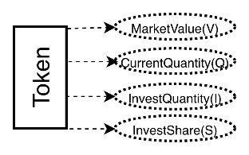
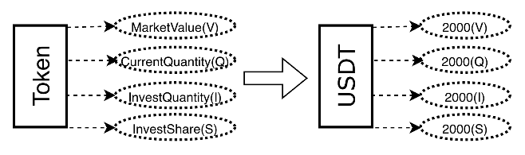
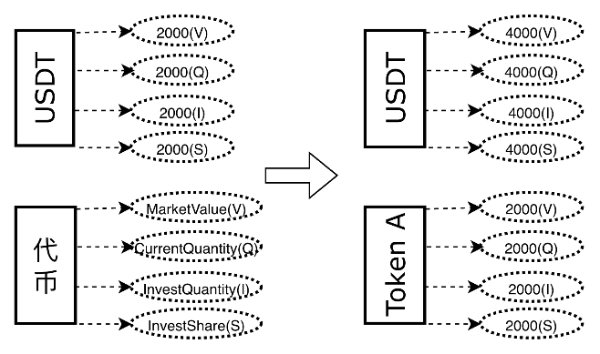
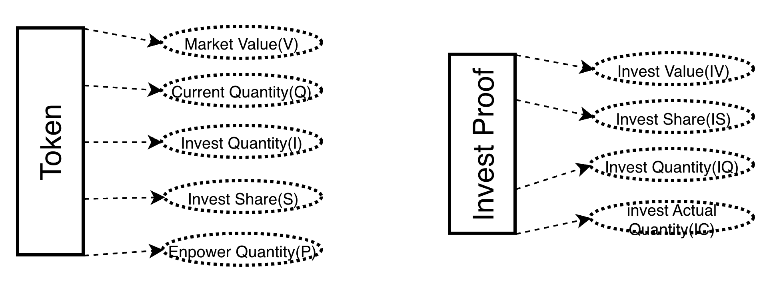
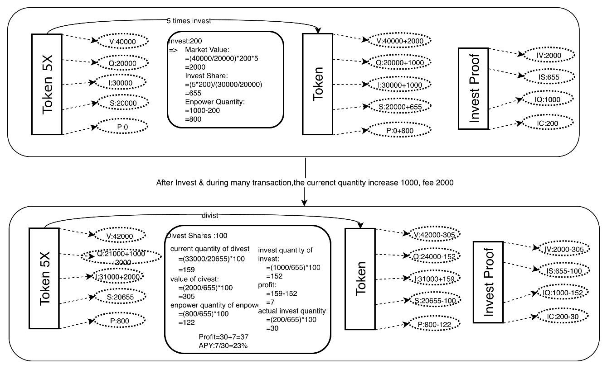
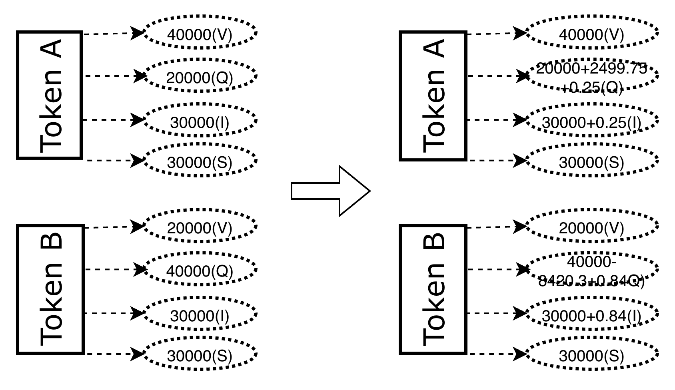
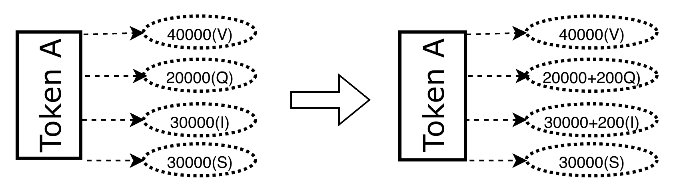
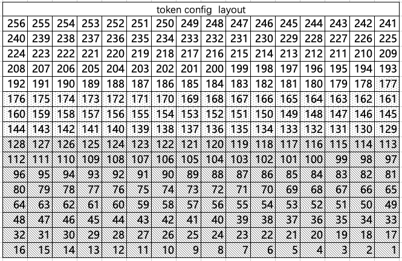

# 📖 TTSWAP Technical Whitepaper

TTSWAP is a decentralized token trading platform that enables users to swap tokens quickly and securely without relying on centralized exchanges.

---

import { ShareButton } from '@site/src/components/ShareButton';

<ShareButton />

## 1. Overview

TTSWAP (Token-Token Swap) is an Automated Market Maker (AMM) protocol built on EVM-compatible blockchains. The protocol executes automatically via smart contracts, eliminating the need for centralized institutions or individuals to match trades. Its core mechanism facilitates price discovery by automatically triggering market value transfers based on user trading behavior.

TTSWAP innovatively constructs a **Constant Value-based Trading Protocol (Constant Value AMM)**. Compared to traditional AMMs, this protocol maintains mathematical model robustness while significantly reducing Gas fees by avoiding complex exponential operations.

This whitepaper will elaborate on the design logic of TTSWAP:

1.  **Token Trading**: Users can directly swap between any tokens, supporting native ETH trading without the need for WETH wrapping.
2.  **Value Tokens & Normal Tokens**: Distinguishes between mainstream value assets and long-tail assets to build a tiered liquidity market.
3.  **Liquidity Management**: Users can invest (provide liquidity) and divest at any time, with the system automatically handling fees and returns.
4.  **Fee Generation & Distribution**: A refined fee distribution mechanism incentivizes Liquidity Providers (LPs), promoters, community builders, and other roles.
5.  **Fair Launch**: The tokenomics model aims to protect the rights of all holders, ensuring long-term project development through a price-driven unlocking mechanism.

In summary, TTSWAP is dedicated to building an efficient, secure, and low-Gas decentralized trading and payment protocol, providing a concise, transparent, and efficient trading experience for DeFi and PayFi users.

## 2. Features

1.  **Constant Value AMM**
    The core idea of the protocol is to ensure "Value Conservation" during the trading process. This model is mathematically compatible with the mainstream CPMM (Constant Product Market Maker, Uniswap) model and supports asymmetric weighted liquidity similar to Balancer, but avoids high Gas consumption through optimized algebraic algorithms.

2.  **Concentrated Liquidity & Direct Trading**
    After users add token liquidity to the protocol, this liquidity can be shared with any other token within the protocol. Users can achieve direct token-to-token swaps, effectively avoiding liquidity fragmentation caused by multi-hop routing in traditional DEXs, significantly enhancing trading depth.

3.  **Liquidity Amplification**
    The protocol dynamically configures liquidity amplification coefficients based on token stability characteristics. A unit of capital provided by users can generate multi-fold effective liquidity depth, significantly improving capital efficiency and yield levels (similar to Curve's amplification principle but extended to general tokens).

4.  **Low Slippage Trading**
    Through liquidity amplification and concentrated liquidity design, TTSWAP significantly reduces trading slippage. Even large trades can achieve excellent price execution.

5.  **Impermanent Loss Protection**
    The protocol protects Liquidity Providers (LPs) from Impermanent Loss (IL) at the architectural level through a specific value anchoring algorithm and a three-tiered defense mechanism, enabling LPs to better maintain their original asset value when withdrawing liquidity.

6.  **Extremely Low Gas Fees**
    Benefiting from streamlined algebraic logic and bit-packing storage technology, contract execution is highly efficient. Compared to similar complex protocols, TTSWAP can save 50% to 90% of Gas fees, making on-chain trading more economical.

7.  **Refined Fee Distribution**
    Fees are automatically distributed according to participant roles, covering Token Administrators (Creators), Token Investors (LPs), Portal Operators, Referrers, and Users. This builds a mutually beneficial ecosystem.

8.  **Native ETH Support**
    The protocol natively supports ETH for direct trading and liquidity provision in its underlying architecture. Users do not need to manually wrap it into WETH, simplifying the interaction process and optimizing user experience.

9.  **Proof of Investment & Liquidity Mining**
    When users provide liquidity, the protocol automatically generates a Proof of Investment. Users can use this proof for liquidity mining to earn additional TTS token rewards.

10. **Price-Driven Tokenomics**
    The TTS token adopts an innovative unlocking model: token unlocking is pegged to price performance (price doubling unlock mechanism), combined with a community profit buyback and burn mechanism, ensuring token circulation matches project value growth.

11. **X402 Payment Protocol Support**
    The protocol has built-in support for the X402 standard. This is a mechanism that separates the "Signer" from the "Payment Executor" (similar to Account Abstraction/PayFi), greatly expanding payment application scenarios and enhancing user payment experience.


## 3. Principles of the Constant Value Trading Model

### 3.1 Core Formulas

When a user swaps $\Delta a$ amount of Token A for Token B, the protocol follows a two-step calculation:

$$
\begin{align}
\text{1. Calculate Transfer Value based on input amount:}  \\
\Delta V &= \frac{2 V_A \Delta a}{2 Q_A + \Delta a}  \\[10pt]
\text{2. Calculate Output Amount based on Transfer Value:}  \\
\Delta b &= \frac{2 Q_B \Delta V}{2 V_B + \Delta V}
\end{align}
$$

*(For the detailed derivation of the Constant Value Model core formulas, see **Appendix A**)*

**Parameter Definitions:**

| Symbol | Meaning | Remarks |
| :--- | :--- | :--- |
| $V_A$ | Total Market Value of Token A in protocol | Represents the token's "weight" in the protocol |
| $Q_A$ | Current Inventory Quantity of Token A | Includes accumulated fees |
| $\Delta a$ | Token A amount input by user | Net amount after fee deduction |
| $V_B$ | Total Market Value of Token B in protocol | |
| $Q_B$ | Current Inventory Quantity of Token B | Includes accumulated fees |
| $\Delta b$ | Token B amount received by user | Gross amount before output fee |

> **Design Philosophy**: The essence of exchange is the mismatch between quantity and value. The protocol automatically balances supply and demand through market means (price slippage).

### 3.2 Mathematical Properties and Comparisons

#### 3.2.1 Relationship with Uniswap (CPMM)

When the configured values of two tokens are equal ($V_A = V_B$), the above formulas are mathematically equivalent to Uniswap's Constant Product formula ($x \cdot y = k$).

**Derivation Brief**:
In the case of $V_A = V_B$, substituting into the formula yields:

$$
\Delta b = \frac{Q_B \Delta a}{Q_A + \Delta a}
$$

*(See **Appendix B** for the simplification process in the case of equal value)*

This is exactly the output formula of the standard CPMM model, meaning TTSWAP possesses the same market depth and pricing characteristics as Uniswap when dealing with standard token pairs.

#### 3.2.2 Relationship with Balancer (Weighted Pools)

When $V_A \neq V_B$, the model exhibits the characteristics of a weighted pool.

*   **Balancer** uses exponential operations $(x^{w_o} \cdot y^{w_i} = k)$ to implement different weights, which is computationally complex and gas-intensive.
*   **TTSWAP** uses the above algebraic formulas to simulate asymmetric liquidity pools **without exponential operations**. This allows TTSWAP to support customized liquidity management for stablecoins (high weight) or emerging tokens (low weight) at extremely low Gas costs.

*(See **Appendix C** for the proof of equivalence with Balancer in unequal value cases)*

### 3.3 State Update After Trading

After the transaction is completed, the token states are updated, forming a new exchange ratio:

| | $Token_A$ (Input Side) | $Token_B$ (Output Side) |
| :--- | :--- | :--- |
| **Value (Weight)** | $V_A$ (Unchanged) | $V_B$ (Unchanged) |
| **Quantity** | $Q_A + \Delta a$ (Increases) | $Q_B - \Delta b$ (Decreases) |

*   **New Marginal Price (Book Price)**:
    $$ P_A^{\text{new}} = \frac{V_A}{Q_A + \Delta a} $$
    $$ P_B^{\text{new}} = \frac{V_B}{Q_B - \Delta b} $$

*   **New Exchange Ratio (Spot Price)**:
    $$ R_{A \to B} = \frac{P_A^{\text{new}}}{P_B^{\text{new}}} $$

> **Note**: Here, $P_A$ and $P_B$ are internal indicators of the token's "scarcity" relative to its weight within the protocol, not direct fiat prices.

## 4. Token

### 4.1 Token Introduction

In the TTSWAP protocol, each Token has four core attributes:

1.  **Market Value ($V$)**: Measures the token's weight in the protocol (Total Weight Value of the pool).
2.  **Current Quantity ($Q$)**: The current token balance held by the protocol (includes accumulated fees).
3.  **Invested Quantity ($I$)**: The total number of tokens deposited by LPs (includes accumulated fees).
4.  **Invested Share ($S$)**: The total share held by LPs.

**Trading Mechanism**: When users believe the market price of a token is lower than the protocol price (i.e., $V/Q$ is high), they tend to sell the token; otherwise, they buy.



### 4.2 Token Classification

| Token Category | Description | Generates Fees | Individual Investment | Combined Investment |
| :--- | :--- | :--- | :--- | :--- |
| **Meta Token** | The first Token added after protocol deployment (e.g., USDT), serving as a value anchor benchmark | Yes | Yes | No |
| **Value Token** | Tokens with high market recognition and mature ecosystem (e.g., ETH, WBTC) | Yes | Yes | No |
| **Normal Token** | Newly added long-tail assets, must be added paired with a Value Token | Yes | No | Yes |

### 4.3 Token Configuration & Gas Optimization

To achieve extreme Gas efficiency, TTSWAP adopts **Bit-packing** technology, compressing all key configuration parameters of a token into a single 256-bit storage slot.

This means reading or updating token configuration requires only one on-chain storage operation (SSTORE/SLOAD), drastically reducing interaction costs.

*(See **Appendix D** for the detailed 256-bit storage layout)*

User-configurable parameters include:

*   **Fee Settings**: Investment fee, divestment fee, buy/sell fee.
*   **Liquidity Amplification Multiplier**: Sets the token's liquidity amplification factor (1 ~ Market-set maximum multiplier).
*   **Divestment Slicing**: A security parameter used to smooth the impact of large withdrawals.

> **Note**: The maximum multiplier set by the market is evaluated based on token project quality and operational quality, with a default value of 1.

## 5. Adding Meta Tokens

**Meta Token** refers to the first token added after the protocol is deployed, typically serving as the protocol's value anchor (e.g., USDT). The Meta Token itself is also a Value Token.



For example, the protocol creator initializes USDT as the Meta Token and injects 2,000 USDT as initial liquidity.

*   **State at this time**:
    *   Market Value ($V$) = 2,000
    *   Token Quantity ($Q$) = 2,000
    *   Invested Quantity ($I$) = 2,000
    *   Invested Share ($S$) = 2,000

## 6. Adding Normal Tokens



When a user adds a Normal Token (e.g., Token A), they must anchor it to an existing Value Token (e.g., USDT) to determine its initial pricing.

Suppose a user adds Token A and anchors it to USDT:

*   **USDT State Update**:
    *   Market Value = 3,000
    *   Token Quantity = 3,000
    *   Invested Quantity = 3,000
    *   Invested Share = 3,000
*   **Token A Initial State**:
    *   Market Value = 1,000
    *   Token Quantity = 2,000
    *   Invested Quantity = 2,000
    *   Invested Share = 2,000

> **Note**: Widely recognized Normal Tokens can be upgraded to Value Tokens upon meeting certain conditions.

## 7. Token Investment & Divestment

In TTSWAP, providing liquidity is called "Investment," and removing liquidity is called "Divestment."

### 7.1 Core Concepts




*   **Token Attributes**
    *   **Market Value (V)**: Measures the token's weight or total market value in the protocol.
    *   **Current Quantity (Q)**: The current token balance held by the protocol (includes accumulated fees).
    *   **Invested Quantity (I)**: The total number of tokens deposited by LPs (includes accumulated fees).
    *   **Invested Share (S)**: The equity share held by LPs. Formula: $\text{Share} = \text{Invested Quantity} / \text{Current Net Asset Value}$.
    *   **Amplified Quantity(P)**: Virtual liquidity generated by the liquidity amplification mechanism.

*   **Proof of Investment (User Proof) Attributes**
    *   **Invest Value(IV)**: The market value of the token at the time of user investment.
    *   **Invest Share(IS)**: The investment share held by the user.
    *   **Invest Quantity(IQ)**: The total quantity of the token at the time of user investment.
    *   **Invest Actual Quantity(IC)**: The actual quantity of the token  at the time of user investment.

### 7.2 Token Investment & Divestment Calculation Process



#### 7.2.1 Investment (Providing Liquidity)

When a user invests tokens:
1.  **Calculate Amplification**: Based on the configured "Liquidity Amplification Multiplier," the protocol virtually increases the input quantity, thereby deepening market depth without increasing actual capital occupation.
2.  **Calculate Share**: Calculate the LP share due to the user based on the current Net Asset Value (NAV) of the pool.
3.  **Update State**: Increase the pool's Market Value, Token Quantity, and Total Invested Share.

#### 7.2.2 Divestment (Removing Liquidity)

When a user divests:
1.  **Calculate Redeemable Quantity**: Calculate the token quantity to be redeemed based on the share percentage held by the user.
2.  **Calculate Return**: $\text{Return} = \text{Current Redeemable Quantity} - \text{Original Invested Quantity}$.
3.  **Divestment Slicing**:
    To prevent whales from draining the pool instantly or causing drastic price fluctuations through large withdrawals, the protocol introduces a "Divestment Slicing" mechanism, limiting the maximum ratio of a single withdrawal (e.g., not exceeding 1/N of the total pool). If the withdrawal amount is too large, the user needs to operate in batches or bear higher slippage costs.

*(See **Appendix E** for the detailed calculation process of Token Investment & Divestment)*

#### 7.3 Triple Defense Mechanism Against Impermanent Loss

To strictly protect the principal safety of ordinary Liquidity Providers (LPs), TTSWAP has designed a unique triple defense system to cope with Impermanent Loss (IL):

1.  **First Line of Defense: Protocol-Level Value Anchoring (Protocol Level)**
    Through the built-in value conservation algorithm of the smart contract, the protocol prioritizes ensuring the base value of LPs upon divestment, reducing passive losses caused by price fluctuations from the underlying logic.

2.  **Second Line of Defense: Project Party Junior Buffer (Capital Level)**
    In the event of a value gap caused by extreme market conditions, the initial liquidity injected by the token issuer (creator) will serve as "junior capital," prioritizing the absorption of losses caused by value fluctuations, thereby protecting the funds of ordinary users.

3.  **Third Line of Defense: Protocol Token Compensation Fund (Governance Level)**
    As a final resort, if the above measures are still insufficient to cover all losses, the protocol will activate the "Risk Compensation Mechanism," raising funds by auctioning or releasing part of the TTS governance tokens to compensate affected users.

## 8. Token Swap Example

This chapter demonstrates the full process of a user swapping $Token_A$ for $Token_B$.


### 8.1 Initial State
*   **Token A**: Value 40,000, Quantity 20,000 (Unit Price 2.0)
*   **Token B**: Value 20,000, Quantity 40,000 (Unit Price 0.5)
*   **Initial Exchange Rate**: 1 Token A = 4 Token B

### 8.2 Trade Calculation
User inputs **2,500** Token A:
1.  **Deduct Fee**: Assuming a fee rate of 0.01%, deduct 0.25 A, actual input to pool $\Delta a = 2,499.75$.
2.  **Calculate Transfer Value**: Calculate $\Delta V \approx 4,705.4$ based on the formula.
3.  **Calculate Output Quantity**: Calculate Token B outflow $\Delta b \approx 8,420.3$ based on $\Delta V$.
4.  **Deduct Output Fee**: Deduct 0.84 B, user actually receives **8,419.46** Token B.

*(See **Appendix F** for the detailed calculation process of Token Swap)*

### 8.3 Result Analysis



After the trade, Token A quantity increases (price drops), Token B quantity decreases (price rises). The protocol automatically completes price discovery.

### 8.4 Contract Security Verification

The protocol has passed multiple mathematical consistency tests:

*   **Fairness**: Swap A for B, then immediately swap B back for A, loss is minimal (excluding fees) (path independence).
*   **Rationality**: The result of a single large trade is consistent with splitting it into multiple small trades (no arbitrage space).
*   **Closed Loop**: The logic of A->B->C->A cyclic trading is self-consistent.

> See modified_swap_without_fee [Test Contract Address](https://github.com/ttswap/ttswap-core/blob/5326e7cef7305d00fe9b909064113becc58968bd/test/modified_swap_without_fee.sol)

## 9. Fees

### 9.1 Fee Sources


Fees are deducted in real-time when a trade occurs and are directly accumulated into the token's "Current Quantity" and "Invested Quantity." This means the Net Asset Value (NAV) of LP shares will monotonically increase with trading volume, and distribution occurs upon LP divestment.

### 9.2 Distribution Mechanism

TTSWAP adopts a multi-role profit-sharing mechanism to promote ecosystem prosperity:


| Role | Share Ratio (Example) | Description |
| :--- | :--- | :--- |
| **Token Administrator** | 1% - 3% | Initial creator or operator of the token |
| **Liquidity Provider (LP)** | 50% - 80% | Core beneficiary, automatic compounding by share |
| **Service Provider** | 5% - 25% | Third parties providing frontend, aggregation, or integration services |
| **Referrer** | 5% - 10% | Promotion ambassadors inviting new users |
| **Community Treasury** | 2% - 8% | Used for buyback & burn of TTS tokens or technical R&D |

If there is no explicit referrer, the relevant ratio will be allocated to the Service Provider or Community Treasury.

*(See **Appendix G** for Token Fee Calculation & Distribution Process)*


## 10. Token Welfare



Project parties can actively inject tokens into the pool as "welfare," which will directly increase the Net Asset Value (NAV) of LP shares, thereby increasing the Annual Percentage Rate (APR) and attracting more liquidity.

## 11. Liquidity Mining


The protocol supports an "Investment is Mining" mechanism. Users' LP shares are automatically converted into hashrate to mine the platform governance token TTS. This achieves dual returns: **Trading Fees + TTS Token Rewards**.

## 12. X402 Payment Protocol Support

TTSWAP implements support for the **X402 Protocol**. This is an advanced **Intent-Centric Payment Standard**, similar to the concept of Account Abstraction or PayFi.

**Core Advantages**:
*   **Separation of Signing and Execution**: Users only need to sign payment intents (offline operation, gas-free), while specific on-chain execution and Gas payment can be handled by a third-party "Executor."
*   **All-Currency Payment**: The application side does not need to care about which token the user holds; the X402 protocol will automatically complete the swap and pay the target currency on-chain.


**Process**:
1.  User accesses the app, app requests payment.
2.  User signs an offline message (Permit).
3.  Executor submits the signature on-chain.
4.  TTSWAP contract verifies signature, automatically swaps tokens, and completes payment.

## 13. Main Code Implementation (See Code)

### 13.1 Contract Deployment GAS

| Deployment Cost | Deployment Size |
| --------------- | --------------- |
| 5,644,297       | 26,543          |

### 13.2 Contract Function (Partial Main Functions) GAS

| Function Name      | avg     | Remarks                 |
| ------------------ | ------- | -------------------- |
| buyGood(NativeETH) | 81,190  | Buy Token           |
| buyGood(ERC20)     | 89,761  | Buy Token           |
| disinvestProof     | 164,402 | Divest                 |
| initGood           | 376,985 | Initialize Token         |
| investGood         | 153,945 | Invest Token           |
| goodWelfare        | 52,396  | Add fees as welfare     |


## 14. Protocol Roles

The protocol supports 5 roles: Token Administrator, Liquidity Provider, Portal Operator, Referrer, User, and Community.

| Role | Income Source | Description |
| :--- | :--- | :--- |
| **Liquidity Provider (LP)** | 50% - 80% | Core contributor to the fund pool, highest income share. |
| **Token Administrator** | 1% - 3% | Operator responsible for token listing and parameter configuration. |
| **Referrer** | 5% - 10% | Promotion ambassador inviting new users. |
| **Portal Operator** | 5% - 25% | Third party providing frontend interface and aggregation services. |
| **Community Treasury** | 2% - 8% | Used for technical development and buyback & burn. |
| **User Discount** | -10% | Users with referral codes enjoy fee reductions. |

## 15. Tokenomics

**TTS Token** is the governance and incentive token of the protocol, adopting an innovative "Price-Driven" unlocking mechanism.

### 15.1 Basic Information
*   **Name**: TTSWAP Token (TTS)
*   **Initial Supply**: 50 Million (Fully Locked)
*   **Inflation Mechanism**: Annual issuance of (200 Million - Unlocked Quantity) × 2% for LP rewards.
*   **Deflation Mechanism**: 100% of community revenue is used for secondary market buyback and burn of TTS.

### 15.2 Core Innovation: Price-Driven Unlocking

To prevent team dumping and early whale selling, TTS unlocking is directly pegged to token price:

*   **Principle**: Tokens unlock only when the price rises.
*   **Mechanism**:
    *   Fully locked upon distribution (except for Public Sale and Liquidity Mining parts).
    *   Set **Initial Price** and **Unlock Ratio** (e.g., 10%).
    *   When the price **doubles**, unlock 10% of the remaining locked amount.
    *   If the price doubles again, unlock another 10% of the remaining amount.
    *   **Result**: The interests of the team and early investors are forcibly bound to long-term price performance.

### 15.3 4C Community Allocation Model

Token allocation follows the 4C role model to ensure contributors are rewarded:

| Role | Description | Ratio | Unlock Limit (Max) | Trigger Condition |
| :--- | :--- | :--- | :--- | :--- |
| **Founder** | Project initiator, bearing maximum risk | 20% | < 1/20 (5%) | Requires 1,000x rise to unlock ~37% |
| **Partner** | Core execution team | 12% | < 1/14 (7.1%) | Requires 400x rise to unlock ~45% |
| **Value Contributor** | Community operation, technical development | 44% | < 1/12 (8.3%) | Requires 200x rise to unlock ~50% |
| **Capital Contributor** | Early investment, public sale, airdrop | 24% | < 1/8 (12.5%) | Requires 100x rise to unlock ~60% |


### 15.4 Dynamic Buyback & Burn

*   The portion of fee revenue generated by the protocol allocated to the "Community Treasury" will be entirely used for **secondary market buyback and burn of TTS**.
*   This constitutes the deflationary engine of TTS. As trading volume grows, the circulating supply will continue to decrease, thereby driving up token value.


## 16. Legal & Licensing

### 16.1 Explanation

To safeguard the legitimate rights and interests of the project while facilitating user understanding of the protocol, different files adopt different open-source licenses. Violating the agreements will result in corresponding legal liabilities.

### 16.2 License Details

To protect intellectual property and promote technical exchange:
*   **Core Logic**: Adopts **BUSL-1.1** (Business Source License). Allows for learning and research but restricts commercial forking within a specific period.
*   **Peripheral Components**: Adopts **MIT** license, encouraging the community to develop peripheral tools and integrated applications.

For detailed copyright information, please refer to the `LICENSE` file in the GitHub repository.

### 16.3 File License Information

```markdown
src
├── TTSwap_Market.sol (BUSL-1.1)
├── TTSwap_Market_Proxy.sol (BUSL-1.1)
├── TTSwap_Token.sol (BUSL-1.1)
├── TTSwap_Token_Proxy.sol (BUSL-1.1)
├── interfaces
│   ├── I_TTSwap_Market.sol (MIT)
│   └── I_TTSwap_Token.sol (MIT)
└── libraries
   ├── L_Currency.sol (MIT)
   ├── L_Error.sol (MIT)
   ├── L_Good.sol (BUSL-1.1)
   ├── L_GoodConfig.sol (MIT)
   ├── L_Proof.sol (BUSL-1.1)
   ├── L_SignatureVerification.sol (MIT)
   ├── L_Transient.sol (MIT)
   ├── L_TTSTokenConfig.sol (MIT)
   ├── L_TTSwapUINT256.sol (MIT)
   └── L_UserConfig.sol (MIT)
docs
├── ebook
tests

```

## 17. Contract Deploy Address

### 17.1 Ethernet Mainnet

| Contract Name | Deploy Address |
 | :--- | :--- |
|TTSwap_Market_Proxy|0x8E2FF92834C75D3132ad5CED6482E660822f5EF6|
|TTSwap_Market|0x7e311CcA6ed6c63D861e4426B0aBaFCeACEf85D6|
|TTSwap_Token_Proxy|0x441D5687245EE9E7388c51159770736fb142Ea9c|
|TTSwap_Token|0x3aF2E663589A227fE351d2Dea7858d94F0e2be1D|

### 17.2 Ethernet Hoodi
| Contract Name | Deploy Address |
| :--- | :--- |
|TTSwap_Market_Proxy|0x8E2FF92834C75D3132ad5CED6482E660822f5EF6|
|TTSwap_Market|0x7e311CcA6ed6c63D861e4426B0aBaFCeACEf85D6|
|TTSwap_Token_Proxy|0x441D5687245EE9E7388c51159770736fb142Ea9c|
|TTSwap_Token|0x3aF2E663589A227fE351d2Dea7858d94F0e2be1D|

## 18. Contact

*   **Twitter**: [ttswapfinance](https://x.com/ttswapfinance)
*   **Telegram**: [@ttswapfinance](https://t.me/ttswapfinance)
*   **Email**: [bussiness@ttswap.io](mailto:bussiness@ttswap.io)
*   **Discord**: [ttswap](https://discord.gg/XygqnmQgX3)
*   **Website**: [ttswap.io](http://www.ttswap.io)


## Appendix A: Detailed Derivation of Constant Value Trading Model Core Formulas

This appendix details how to derive the core trading formulas of TTSWAP from the "Harmonic Mean Price" principle.

The TTSWAP trading process is divided into two independent steps:
1.  **Input Side**: Convert input Token A into standard value ($\Delta V$).
2.  **Output Side**: Convert standard value ($\Delta V$) into output Token B.

### Step 1: Calculate Value $\Delta V$ corresponding to Input Token A

We use the **Harmonic Mean** to determine the execution price of the trade. Compared to the arithmetic mean, the harmonic mean better smooths price fluctuations and ensures trade fairness.

**1. Define Instantaneous Value Density (Price)**
*   **Pre-Trade State**:
    The protocol holds $Q_A$ Token A with a total value of $V_A$.
    $$ P_{\text{start}} = \frac{V_A}{Q_A} $$
*   **Post-Trade State (Hypothetical)**:
    The protocol holds $Q_A + \Delta a$ Token A, total value remains $V_A$ (calculating marginal contribution).
    $$ P_{\text{end}} = \frac{V_A}{Q_A + \Delta a} $$

**2. Calculate Execution Price (Harmonic Mean)**
Take the harmonic mean of prices before and after the trade to get the effective execution price $P_{\text{exec}}$:

$$
P_{\text{exec}} = \text{HarmonicMean}(P_{\text{start}}, P_{\text{end}}) = \frac{2}{\frac{1}{P_{\text{start}}} + \frac{1}{P_{\text{end}}}}
$$

Substitute $P_{\text{start}}$ and $P_{\text{end}}$:

$$
P_{\text{exec}} = \frac{2}{\frac{Q_A}{V_A} + \frac{Q_A + \Delta a}{V_A}} = \frac{2}{\frac{2Q_A + \Delta a}{V_A}} = \frac{2 V_A}{2 Q_A + \Delta a}
$$

**3. Calculate Transfer Value $\Delta V$**
$$
\Delta V = P_{\text{exec}} \cdot \Delta a = \frac{2 V_A \Delta a}{2 Q_A + \Delta a}
$$

---

### Step 2: Calculate Output Quantity $\Delta b$ based on Value $\Delta V$

On the output side, we focus on "Token Quantity per Unit Value" (inverse of price, denoted as $D$).

**1. Define Instantaneous Quantity Density**
*   **Pre-Trade State**:
    The protocol holds $Q_B$ Token B with a total value of $V_B$.
    $$ D_{\text{start}} = \frac{Q_B}{V_B} $$
*   **Post-Trade State (Hypothetical)**:
    Total value increases by $\Delta V$, becoming $V_B + \Delta V$.
    $$ D_{\text{end}} = \frac{Q_B}{V_B + \Delta V} $$

**2. Calculate Execution Density (Harmonic Mean)**
$$
D_{\text{exec}} = \text{HarmonicMean}(D_{\text{start}}, D_{\text{end}}) = \frac{2}{\frac{1}{D_{\text{start}}} + \frac{1}{D_{\text{end}}}}
$$

Substitute $D_{\text{start}}$ and $D_{\text{end}}$:

$$
D_{\text{exec}} = \frac{2}{\frac{V_B}{Q_B} + \frac{V_B + \Delta V}{Q_B}} = \frac{2 Q_B}{2 V_B + \Delta V}
$$

**3. Calculate Output Quantity $\Delta b$**
$$
\Delta b = D_{\text{exec}} \cdot \Delta V = \frac{2 Q_B \Delta V}{2 V_B + \Delta V}
$$

Thus, the core formula derivation is complete.

---

## Appendix B: Formula Simplification in Equal Value Case (Uniswap Equivalence Proof)

This appendix proves that when the weights (values) of two tokens are equal, the TTSWAP trading model is mathematically completely equivalent to the Uniswap Constant Product formula (CPMM).

### 1. Set Conditions
Assume the configured values of $Token_A$ and $Token_B$ are equal, i.e.:
$$ V_A = V_B = V $$

### 2. Combine Formulas
Combine the two steps from Appendix A.

**Input Side**:
$$ \Delta V = \frac{2 V \Delta a}{2 Q_A + \Delta a} $$

**Output Side**:
$$ \Delta b = \frac{2 Q_B \Delta V}{2 V + \Delta V} $$

### 3. Substitution and Simplification
Substitute the expression of $\Delta V$ into the formula for $\Delta b$:

$$
\Delta b = \frac{2 Q_B \cdot (\frac{2 V \Delta a}{2 Q_A + \Delta a})}{2 V + (\frac{2 V \Delta a}{2 Q_A + \Delta a})}
$$

Divide numerator and denominator by $2V$:

$$
\Delta b = \frac{Q_B \cdot (\frac{2 \Delta a}{2 Q_A + \Delta a})}{1 + (\frac{\Delta a}{2 Q_A + \Delta a})}
$$

Simplify the denominator:
$$
\text{Denominator} = \frac{(2 Q_A + \Delta a) + \Delta a}{2 Q_A + \Delta a} = \frac{2 Q_A + 2 \Delta a}{2 Q_A + \Delta a} = \frac{2(Q_A + \Delta a)}{2 Q_A + \Delta a}
$$

Substitute the denominator back into the original equation:

$$
\Delta b = \frac{Q_B \cdot \frac{2 \Delta a}{2 Q_A + \Delta a}}{\frac{2(Q_A + \Delta a)}{2 Q_A + \Delta a}}
$$

Cancel the common term $\frac{2}{2 Q_A + \Delta a}$:

$$
\Delta b = \frac{Q_B \Delta a}{Q_A + \Delta a}
$$

### 4. Conclusion
The above equation is the standard output formula of Uniswap (ignoring fees):
$$ \Delta y = \frac{y \Delta x}{x + \Delta x} $$

**Q.E.D.** This demonstrates that TTSWAP is a generalized extension of the CPMM model: it degenerates into CPMM when $V_A=V_B$ and exhibits weighted pool characteristics when $V_A \neq V_B$.


## Appendix C: Formula Derivation in Unequal Value Case and Balancer Equivalence Proof

This appendix delves into the mathematical properties of the TTSWAP trading model when $V_A \neq V_B$, proving its complete equivalence with the Balancer weighted formula under infinitesimal increments (Spot Price) and high fitting under large trades.

### 1. Balancer Model Review
Balancer uses the Weighted Product Formula:
$$ (Q_A)^{W_A} \cdot (Q_B)^{W_B} = k $$
Its exchange price (Spot Price) depends on the reserve ratio and weight ratio:
$$ SP_{\text{Balancer}} = \frac{Q_B / W_B}{Q_A / W_A} $$
(Ignoring fees, priced in A for B)
$$ SP_{\text{Balancer}} = \frac{Q_A W_B}{Q_B W_A} $$

### 2. TTSWAP Model Marginal Price Derivation

We calculate the marginal price by differentiating the core formula of TTSWAP.

**Input Side (Token A -> Value)**:
$$ \Delta V = \frac{2 V_A \Delta a}{2 Q_A + \Delta a} $$
When $\Delta a \to 0$ (Differential perspective):
$$ dV = \lim_{\Delta a \to 0} \frac{2 V_A \Delta a}{2 Q_A} = \frac{V_A}{Q_A} da $$

**Output Side (Value -> Token B)**:
$$ \Delta b = \frac{2 Q_B \Delta V}{2 V_B + \Delta V} $$
When $\Delta V \to 0$:
$$ db = \lim_{\Delta V \to 0} \frac{2 Q_B \Delta V}{2 V_B} = \frac{Q_B}{V_B} dV $$

**Comprehensive Exchange Rate (Spot Price)**:
Combine the above two equations:
$$ db = \frac{Q_B}{V_B} \cdot (\frac{V_A}{Q_A} da) $$
Instantaneous exchange rate:
$$ \frac{db}{da} = \frac{Q_B V_A}{V_B Q_A} $$

Therefore, TTSWAP's Spot Price is:
$$ SP_{\text{TTSWAP}} = \frac{da}{db} = \frac{1}{\frac{Q_B V_A}{V_B Q_A}} = \frac{Q_A V_B}{Q_B V_A} $$

### 3. Equivalence Comparison

| Parameter | Balancer (Weighted Pool) | TTSWAP (Constant Value) |
| :--- | :--- | :--- |
| **Weight Definition** | Weight $W_i$ | Market Value $V_i$ |
| **Spot Price** | $SP = \frac{Q_A W_B}{Q_B W_A}$ | $SP = \frac{Q_A V_B}{Q_B V_A}$ |

**Conclusion 1 (Spot Price Equivalence)**:
As long as we regard **Market Value $V$** in TTSWAP as **Weight $W$** in Balancer, the spot price logic of both is **completely equivalent**.
i.e.:
$$ \frac{V_A}{V_B} \iff \frac{W_A}{W_B} $$

### 4. Curve Fitting for Large Trades

Balancer's exponential curve has constant elasticity, while TTSWAP uses a harmonic mean curve (a form of hyperbola).

Although there are slight differences in slippage curves for large trades (large $\Delta a$), their mathematical properties are highly consistent:
1.  **Convexity**: Both are convex functions, ensuring price increases with purchase volume (slippage).
2.  **Asymptote**: Both have asymptotes, meaning the pool cannot be drained.
3.  **Computational Complexity**:
    *   **Balancer**: Requires calculating fractional powers $(x^{W_A/W_B})$, which is complex on-chain and consumes high Gas.
    *   **TTSWAP**: Only involves addition, subtraction, multiplication, and division, with constant and extremely low Gas consumption.

**Conclusion 2 (Engineering Advantage)**:
TTSWAP achieves the same pricing logic (Spot Price) and market depth behavior as weighted pools while eliminating exponential operations through algebraic approximation, realizing an **O(1) complexity** weighted trading experience rare in DeFi protocols. This means it can achieve Balancer-level multi-asset portfolio management capabilities at Uniswap  low Gas fees.

## Appendix D: Token Configuration Storage Layout

For extreme Gas optimization, Token configuration uses the following bit-packed structure (256 bits):



*   `[1-128]` Occupied, stores Market Value field.
*   `[129-177]` Reserved fields.
*   `[178-256]` Currently used configuration fields.

**Admin Config Area**:

| id  | Config Item | Bits | Unit | Max | Min | Start | End | Description |
| --- | ------------------ | ---- | -------- | ------ | ------ | ------ | ------ | ---- |
| 1   | Is Value Token     | 1    | BOOLEAN  | 1      | 0      | 256    | 256    |      |
| 2   | Is Frozen          | 1    | BOOLEAN  | 1      | 0      | 255    | 255    |      |
| 3   | Investor Fee Share | 3    | 1/10     | 7      | 1      | 252    | 254    |      |
| 4   | Operator Fee Share | 4    | 2/100    | 7      | 1      | 248    | 251    |      |
| 5   | Portal Fee Share   | 3    | 4/100    | 7      | 1      | 245    | 247    |      |
| 6   | Referrer Fee Share | 5    | 1/100    | 31     | 1      | 240    | 244    |      |
| 7   | User Fee Share     | 5    | 1/100    | 31     | 1      | 235    | 239    |      |
| 8   | Protocol Fee Rate  | 5    | 1/100    | 31     | 1      | 230    | 234    |      |
| 9   | Max Liquidity Amp  | 5    | 1x       | 31     | 1      | 225    | 229    |      |
| 10  | Applied            | 1    | 1x       | 1      | 1      | 224    | 224    |      |
| ... |                    |      |          |        |        |        |        |      |

> **Remark**: Sum of fee shares is 100%.

**User Config Area**:

| id  | Config Item | Bits | Unit | Max | Min | Start | End | Description |
| --- | -------------- | ---- | -------- | ------ | ------ | ------ | ------ | ------------- |
| 1   | Invest Fee     | 6    | 1/10000  | 63     | 0      | 218    | 223    | (0~63)/10000  |
| 2   | Divest Fee     | 6    | 1/10000  | 63     | 0      | 212    | 217    | (0~63)/10000  |
| 3   | Buy Fee        | 7    | 1/10000  | 127    | 0      | 205    | 211    | (0~127)/10000 |
| 4   | Sell Fee       | 7    | 1/10000  | 127    | 0      | 198    | 204    | (0~127)/10000 |
| 5   | Liquidity Amp  | 5    | 1        | 31     | 0      | 188    | 192    | (1~1023)      |
| 6   | Divest Slicing | 10   | 1        | 1023   | 0      | 178    | 187    | (1~1023)      |

*(Note: Specific bit offsets may be fine-tuned with contract version upgrades; refer to on-chain code)*

## Appendix E: Token Investment & Divestment Detailed Calculation Process

### 1. Initial State Setting

This case aims to demonstrate the full lifecycle calculation of LP participating in liquidity investment and divestment.

**1.1 Token State**
*   **Market Value ($V$)**: 40,000
*   **Current Quantity ($Q$)**: 20,000
*   **Total Invested Quantity ($I$)**: 30,000
*   **Total Invested Share ($S$)**: 20,000
*   **Liquidity Amp Multiplier**: 5x (Virtual Amplification)

**1.2 User Proof Initial State**
*   **Invested Value**: 0
*   **Invested Share**: 0
*   **Invested Quantity**: 0
*   **Actual Input**: 0

---

### 2. Investment Process

User decides to invest **200** tokens to provide liquidity.

**Step 1: Calculate Virtual Invested Quantity**
Based on the 5x multiplier, the protocol maps the user's actual input to a virtual invested amount:
$$ \text{Virtual Invested Amount} = 200 \times 5 = 1,000 $$

**Step 2: Calculate Invested Value**
Lock the value at the time of investment based on current market price ($V/Q$):
$$ \text{Invested Value} = \frac{V}{Q} \times \text{Virtual Invested Amount} = \frac{40,000}{20,000} \times 1,000 = 2,000 $$

**Step 3: Calculate Acquired Share**
Calculate the LP share obtained by the user based on the current NAV:
$$ \text{New Share} = \frac{\text{Total Invested Share}}{\text{Total Invested Quantity}} \times \text{Virtual Invested Amount} = \frac{20,000}{30,000} \times 1,000 \approx 667 $$

**Step 4: Calculate Amplified Quantity (Virtual Part)**
$$ \text{Amplified Quantity} = \text{Virtual Invested Amount} - \text{Actual Input} = 1,000 - 200 = 800 $$

**Step 5: Update System State**
*   **Market Value**: $40,000 + 2,000 \rightarrow 42,000$
*   **Current Inventory**: $20,000 + 1,000 \rightarrow 21,000$ (Includes virtual increment)
*   **Total Invested Quantity**: $30,000 + 1,000 \rightarrow 31,000$
*   **Total Invested Share**: $20,000 + 667 \rightarrow 20,667$

**Step 6: Update User Proof**
*   **Invested Value**: 2,000
*   **Invested Share**: 667
*   **Invested Quantity**: 1,000
*   **Actual Input**: 200

---

### 3. Market Transition

Assume after a period, the token pool state changes due to market trading (price fluctuation or fee accumulation):
*   **Market Value**: 42,000 (Unchanged)
*   **Current Inventory**: 21,000 $\rightarrow$ 24,000 (Increased)
*   **Total Invested Quantity**: 31,000 $\rightarrow$ 33,000 (Increased)
*   **Total Invested Share**: 20,667 (Unchanged)

---

### 4. Divestment Process

User decides to redeem **100** LP shares.

**Step 1: Calculate Current Redeemable Quantity**
$$ \text{Current Quantity} = \frac{\text{Total Invested Quantity}}{\text{Total Invested Share}} \times \text{Redeem Share} = \frac{33,000}{20,667} \times 100 \approx 159.67 $$

**Step 2: Calculate Original Invested Principal**
Trace back original input based on the ratio in the user's investment proof:
$$ \text{Original Quantity} = \frac{\text{Invested Quantity in Proof}}{\text{Invested Share in Proof}} \times \text{Redeem Share} = \frac{1,000}{667} \times 100 \approx 150 $$

**Step 3: Calculate Value at Investment**
$$ \text{Original Value} = \frac{\text{Invested Value in Proof}}{\text{Invested Share in Proof}} \times \text{Redeem Share} = \frac{2,000}{667} \times 100 \approx 300 $$

**Step 4: Calculate Net Return**
$$ \text{Return} = \text{Current Quantity} - \text{Original Quantity} = 159.67 - 150 = 9.67 $$

**Step 5: Deduct Virtual Amplified Part**
User can only withdraw actual assets, need to deduct the initial virtual amplification amount:
$$ \text{Deduct Amplified Amount} = \frac{\text{Amplified Quantity in Proof}}{\text{Invested Share in Proof}} \times \text{Redeem Share} = \frac{800}{667} \times 100 \approx 120 $$

**Step 6: Fee Distribution**
Assume LP share ratio is 70%, remaining 30% allocated to platform, referrers, etc.:
$$ \text{User Net Return} = \text{Total Return} \times 70\% = 9.67 \times 0.7 \approx 6.76 $$
$$ \text{Commission Deduction} = \text{Total Return} \times 30\% = 9.67 \times 0.3 \approx 2.90 $$

**Step 7: Calculate Actual Receipt**
$$ \text{Actual Receipt} = \text{Current Quantity} - \text{Deduct Amplified Amount} - \text{Commission Deduction} = 159.67 - 120 - 2.90 = 36.77 $$
*(Includes: Principal part $150-120=30$, Net Return part $6.76$)*

**Step 8: Calculate Yield**
$$ \text{Yield} = \frac{\text{User Net Return}}{\text{Actual Principal}} = \frac{6.76}{30} \approx 22.5\% $$

**Step 9: Update System State**
Deduct corresponding market value, inventory, and share.

**Step 10: Update User Proof**
Deduct redeemed shares and corresponding value/quantity records from user proof.

> **Note**: The protocol has a "Divestment Slicing" protection mechanism. If a single withdrawal exceeds a certain proportion of the total pool (e.g., 1/10), the transaction will fail to prevent whales from crashing the market.

## Appendix F: Token Swap Detailed Calculation Process

### 1. Initial State

**1.1 Token A (Input Token)**
*   **Market Value ($V_A$)**: 40,000
*   **Current Inventory ($Q_A$)**: 20,000 (Unit Price $P_A = 2.0$)
*   **Trade Fee Rate**: 0.01%

**1.2 Token B (Output Token)**
*   **Market Value ($V_B$)**: 20,000
*   **Current Inventory ($Q_B$)**: 40,000 (Unit Price $P_B = 0.5$)
*   **Trade Fee Rate**: 0.01%

---

### 2. Input Calculation

User inputs **2,500** Token A for swap.

**Step 1: Deduct Input Fee**
$$ \text{Input Fee} = \text{Input Amount} \times \text{Rate} = 2,500 \times 0.01\% = 0.25 $$
$$ \Delta a (\text{Net Input}) = 2,500 - 0.25 = 2,499.75 $$

**Step 2: Calculate Transfer Value**
Calculate value increment $\Delta V$ brought by Token A using the core formula:
$$ \Delta V = \frac{2 V_A \Delta a}{2 Q_A + \Delta a} = \frac{2 \cdot 40,000 \cdot 2,499.75}{2 \cdot 20,000 + 2,499.75} \approx 4,705.4 $$

---

### 3. Output Calculation

**Step 3: Calculate Gross Output Quantity**
Calculate Token B quantity to be output based on transfer value $\Delta V$:
$$ \Delta b_{\text{gross}} = \frac{2 Q_B \Delta V}{2 V_B + \Delta V} = \frac{2 \cdot 40,000 \cdot 4,705.4}{2 \cdot 20,000 + 4,705.4} \approx 8,420.3 $$

**Step 4: Deduct Output Fee**
$$ \text{Output Fee} = \Delta b_{\text{gross}} \times \text{Rate} = 8,420.3 \times 0.01\% \approx 0.84 $$
$$ \Delta b_{\text{net}} (\text{User Actual Receive}) = 8,420.3 - 0.84 = 8,419.46 $$

---

### 4. Post-Trade Update

**4.1 Token A Update**
*   **Market Value**: 40,000 (Unchanged)
*   **Current Inventory**: $20,000 + 2,499.75 + 0.25 = 22,500$
*   **Total Invested Quantity**: $30,000 + 0.25 = 30,000.25$ (Fees go into pool)

**4.2 Token B Update**
*   **Market Value**: 20,000 (Unchanged)
*   **Current Inventory**: $40,000 - 8,420.3 + 0.84 = 31,580.54$
*   **Total Invested Quantity**: $30,000 + 0.84 = 30,000.84$ (Fees go into pool)

**4.3 Result Analysis**
*   **User**: Pays 2,500 Token A, receives 8,419.46 Token B.
*   **Protocol**: Collects fees 0.25 A + 0.84 B, accumulated into respective LP pools, increasing LP NAV.
*   **Price Impact**:
    *   Token A Price: $40,000 / 22,500 \approx 1.78$ (Drops)
    *   Token B Price: $20,000 / 31,580 \approx 0.63$ (Rises)
    *   Protocol automatically completes price discovery.


## Appendix G: Token Fee Detailed Calculation and Distribution Process (Fee Logic)
<!-- 
 -->

### 1. Fee Accumulation

**Principle**:
In TTSWAP, fees generated from every trade (whether Token A on the input side or Token B on the output side) are directly **retained in the token's Current Inventory ($Q$) and Invested Quantity ($I$)**, without changing the Market Value ($V$) or the LP's Invested Share ($S$).

**Formula**:
$$ I_{new} = I_{old} + \text{Fee} $$
$$ \text{Net Asset Value (NAV)} = \frac{I + \text{Accumulated Fees}}{S} $$

*   As trading volume increases, $\text{Accumulated Fees}$ continue to accumulate.
*   Therefore, the **Net Asset Value per LP Share** monotonically increases.

---

### 2. Lifecycle Demo

**Phase 1: Initial State (Fig 1)**
*   User has not entered, initial NAV in system is set to 1.5.

**Phase 2: User Investment (Fig 2)**
*   User deposits funds, system calculates shares obtained based on **current NAV**.
*   $$ S_{user} = \frac{\text{User Invested Amount}}{\text{Current NAV}} $$
*   At this point, the shares held by the user are fixed, but the value behind the shares floats with NAV.

**Phase 3: Value Growth (Fig 3)**
*   As market trading becomes active, fees are continuously injected into the fund pool.
*   **Result**: Total token quantity ($Q$) in the pool increases, but total share ($S$) remains unchanged (assuming no deposits/withdrawals).
*   **Effect**: NAV rises, each share in the user's hand can now redeem more tokens.

**Phase 4: User Divestment & Distribution (Fig 4)**
*   User applies to redeem shares.
*   **Principal Return**: System first calculates and returns the user's original principal.
*   **Return Calculation**: $$ \text{Total Return} = (\text{Redeemed Share} \times \text{Current NAV}) - \text{Original Principal} $$
*   **Profit Sharing**: Distribute the calculated total return in real-time according to preset ratios (e.g., LP 70%, Platform 30%).

Through this mechanism, TTSWAP achieves **Automatic Compounding**: LPs do not need to manually claim rewards and restake; fees are retained in the pool to generate new liquidity until settlement upon divestment.
