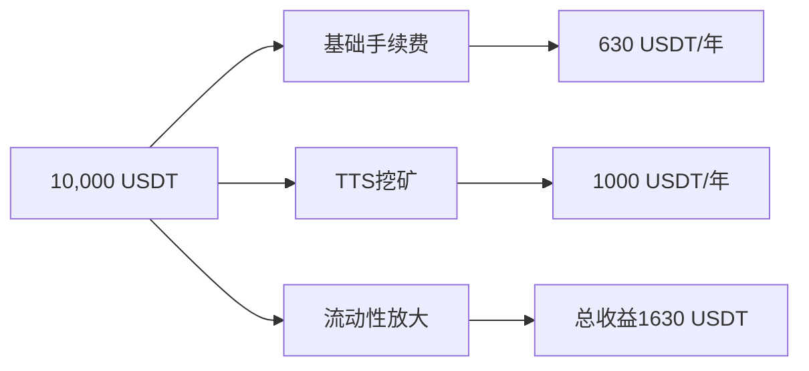

# 💎如何投资TTSWAP

三重路径参与下一代DeFi巨头 

___

import { ShareButton } from '@site/src/components/ShareButton';  

<ShareButton />

## 🚀 **TTSwap 项目投资方案：三重路径参与下一代DeFi巨头**

**—— 全球首个「零无常损失+流动性放大」协议，早期投资者的黄金机会**

## 🌟 **为什么投资TTSwap？**

TTSWAP作为新一代去中心化交易协议，正处于爆发前夜，具有以下核心投资价值：

### 1. 🎯 技术护城河

- **革命性交易模型** ⚡
  - 恒定价值交易，彻底解决滑点问题
  - Gas费节省50%-90%，显著降低交易成本
  - 多资产动态平衡，提升资金利用效率
  - 没有无常损失，保证LP收益

### 2. 💰 商业模式验证
- **多元化收入来源** 📈
  - 交易手续费：稳定现金流
  - 流动性挖矿：持续收益
  - 代币增值：长期价值增长
  - 生态扩展：无限想象空间

### 3. 🌊 代币经济优势
- **Web3交易需求激增**
  - DeFi用户年增长300%
  - 交易量持续攀升
  - 机构资金加速入场
  - 生态应用爆发增长

### 4. 🌊市场稀缺性


### 📈 **成长预期**
| 时间节点 | 预期里程碑 | 估值提升 |
|---------|-----------|----------|
| 2026 Q1 | 多链 | 2-3倍 |
| 2026 Q3 | 200M | 5-8倍 |
| 2027 Q2 | 用户超10万 | 10-15倍 |
---
## 💰 **投资方式一：参与代币公售**
- **总供应量**：5000万枚
- **公售份额**：500万枚（10%）
### 📊 **阶梯价格优势**
| 轮次 | 价格 | 额度 | 剩余 | 投资价值 |
|------|------|------|------|----------|
| 创始轮 | 1 USDT = 24 TTS | 8.25万USDT | 42% | **最低价入场** |
| 早鸟轮 | 1 USDT = 20 TTS | 7万USDT | 30% | 价格上涨20% |
| 公众轮 | 1 USDT = 16 TTS | 8.25万USDT | 28% | 价格再涨25% |

### 💸 **公售投资收益预测**

```python
创始轮投资1000 USDT：
获得24,000 TTS
若年底0.1 USDT：价值2,400 USDT（+140%）
```

### 🎁 **公售专属福利**
- 前100名：空投活动时额外10% TTS空投
- 大额投资(≥5000 USDT)：空投活动时额外20% TTS空投
---

## 🏊 **投资方式二：提供流动性挖矿**

### 💎 **流动性提供核心优势**
1. **零无常损失**：创新算法保障本金安全
2. **流动性放大**：一倍流动性，多倍手续费分润
3. **三重收益引擎**：
   - 50%-80%手续费分润
   - TTS二次挖矿奖励
   - 流动性放大额外收益


### 📊 **收益对比传统DEX**
| 收益指标 | 传统DEX | TTSwap | 提升倍数 |
|---------|---------|--------|----------|
| 手续费分润 | 一倍流动性一倍收益 | 一倍流动性多倍收益 | 5倍+ |
|TTS挖矿|无|提供流动性就tts挖矿|APY 5% +|
| 年化收益率 | 2-5% | 5-15% | 3倍 |
| 本金风险 | 有无常损失 | 零无常损失 | 风险降至零 |

### 💹 **收益模拟（10,000 USDT投入）**

**年化收益率：16.3%+**

### 🎁 **流动性挖矿福利**
- 前1000名用户,空投活动时额外10% TTS空投
- 提供实际流动性超20000U,空投活动额外20% TTS空投
---

## 🤝 **投资方式三：直接项目投资**

### 💼 **适合投资者类型**
- 机构投资者
- 家族办公室
- 高净值个人
- 战略合作伙伴

### 📋 **投资方案选择**
| 投资级别 | 投资额度 | 专属权益 |
|---------|----------|----------|
| 白银级 | 5-50万USDT | 季度报告+基础支持 |
| 黄金级 | 50-200万USDT | 月度沟通+定制策略 |
| 黑钻级 | 200万USDT+ | 董事会席位+联合生态建设 |

### 🔑 **直接投资核心权益**
1. **优先退出权**：享有项目收益的优先分配
2. **治理深度参与**：关键决策投票权
3. **生态合作优先**：未来子项目的优先投资权


## 🛡️ **风险控制与安全保障**

### 🔒 **四重安全保障**
1. **资金托管**：多重签名冷钱包管理
2. **保险基金**：2000 ETH应对极端行情
3. **法律合规**：与合规顾问合作确保合法性

### 📜 **透明度承诺**
- 所有交易链上可查
- 季度财务公开审计
- 社区治理完全透明
---

## 🎯 **投资建议与策略**

### 💡 **资产配置建议**
| 风险偏好 | 公售比例 | 流动性挖矿 | 直接投资 |
|---------|---------|-----------|----------|
| 保守型 | 30% | 50% | 20% |
| 平衡型 | 40% | 30% | 30% |
| 进取型 | 50% | 20% | 30% |

### ⏰ **投资时机建议**
- **立即参与**：公售创始轮（最优价格）
- **持续投入**：流动性挖矿（稳定收益）
- **战略布局**：直接投资（长期价值）

---

## 📞 **立即行动**
### 🌐 **参与渠道**
- **公售平台**：[https://app.ttswap.io](https://app.ttswap.io)
- **流动性挖矿**：[https://app.ttswap.io/](https://app.ttswap.io)
- **直接投资咨询**：bd@ttswap.io

### 📱 **联系信息**
Twitter:[@ttswapfinance](https://x.com/ttswapFinance)  
Telegram:[@ttswapfinance](https://t.me/ttswapfinance)  
Email:[bussiness@ttswap.io](mailto:bussiness@ttswap.io)  
Discord:[ttswap](https://discord.gg/XygqnmQgX3)  
Website:[ttswap.io](http://ttswap.io)  
Github:[ttswap](http://github.com/ttswap)  

---

## 💰 **投资总结**

**TTSwap为不同风险偏好的投资者提供了完整的投资矩阵：**

🎯 **追求高回报** → 参与公售，捕获早期红利  
🎯 **稳健收益** → 流动性挖矿，享受稳定现金流  
🎯 **深度参与** → 直接投资，共享生态发展红利  

**无论选择哪种方式，您都在投资DeFi的未来！**
---


*本资料仅供参考，不构成投资建议。投资有风险，入市需谨慎。*  
