# 📖TTSWAP 技术白皮书  

TTSWAP 是一个去中心化的代币交易平台，支持用户快速、安全地进行代币兑换，无需依赖中心化交易所。

---

import { ShareButton } from '@site/src/components/ShareButton';  

<ShareButton />
    
## 1 概要  

TTSWAP (Token-Token Swap) 是建立在支持 EVM 的区块链上的自动做市协议 (Automated Market Maker， AMM）。该协议通过智能合约自动执行，无需依赖中心化机构或个人参与交易撮合。其核心机制基于用户交易行为，自动触发市场价值转移，实现价格发现功能。

TTSWAP 创新性地构建了**基于恒定价值的交易协议 (Constant Value AMM)**。相比传统 AMM，TTSWAP 深度贴近用户核心诉求：
- **人人皆可获利**：为代币创建者、投资者(LP)、门户运营方、推荐人及普通用户提供多维度的生态角色与分润机会。
- **极致降低损耗**：通过直达交易、集中流动性与流动性放大技术，大幅削减中转手续费、交易滑点及 Gas 开支。
- **本金安全至上**：建立协议级、资金级、治理级的三重防御体系，全方位严守用户本金安全。
- **驱动收益倍增**：利用流动性放大效应结合 TTS 挖矿奖励，为参与者开启财富增长新引擎。
- **公平透明社区**：采用创新的价格导向型解锁机制与透明公售，确保生态在公正、开放的环境中长效发展。

本白皮书将详细阐述 TTSWAP 的设计逻辑：

1. **Token 交易**：用户可直接进行任意 Token 间的兑换，支持原生 ETH 直接交易，无需 WETH 中转。 
2. **价值 Token 与普通 Token**：区分主流价值资产与长尾资产，构建分层流动性市场。  
3. **流动性管理**：用户可投资（提供流动性）并随时撤资，系统自动处理费率与收益。  
4. **手续费产生与分配**：精细化的手续费分配机制，激励流动性提供者、推广者、社区建设者等多方角色。  
5. **公平启动**：代币经济模型旨在维护所有持有者的权益，通过价格导向的解锁机制确保项目长期发展。

综上所述，TTSWAP 致力于构建一个高效、安全、低 Gas 成本的去中心化交易与支付协议，为 DeFi 和 PayFi 用户提供简洁、透明、高效的交易体验。

## 2 特点

1.  **恒定价值交易协议 (Constant Value AMM)**
    协议的核心思想是确保交易过程中的"价值守恒"。该模型在数学上兼容主流的 CPMM （Constant Product Market Maker， Uniswap ） 模型，同时支持类似 Balancer 的非对称权重流动性，但通过优化的代数算法避免了高昂的 Gas 消耗。

2.  **集中流动性与直接交易**
    用户向协议添加代币流动性后，该流动性可与协议内其他任意代币共享。用户可实现代币间的直接兑换，有效避免传统 DEX 中因多跳路由导致的流动性碎片化问题，显著提升交易深度。

3.  **流动性放大机制 (Liquidity Amplification)**
    协议根据代币的稳定性特征，动态配置流动性放大系数。用户提供的单位资金可产生多倍有效流动性深度，显著提升资金利用效率和收益水平（该机制类似 Curve 的流动性放大原理，但适用范围扩展至通用代币）。

4.  **低滑点交易**
    通过流动性放大机制和集中流动性设计，TTSWAP 能够显著降低交易滑点。即使是大额交易，也能获得优异的价格执行效果。

5.  **无常损失防护**
    协议通过特定的价值锚定算法和三重防御机制，在架构层面保护流动性提供者 （LP， Liquidity Provider） 免受无常损失影响，使 LP 在撤出流动性时能够更好地保持原有资产价值。

6.  **极致低 Gas 费用**
    得益于精简的代数运算逻辑和位压缩存储技术，合约执行效率极高。相比于同类复杂协议，TTSWAP 可节省 50% 至 90% 的 Gas 费用，使链上交易更加经济。

7.  **精细化手续费分配**
    手续费根据参与者的不同角色进行自动分配，涵盖代币管理员 (Token 创建者)、Token 投资者 (LP)、门户运营者、推荐人和普通用户。这构建了一个多方共赢的生态系统。

8.  **原生 ETH 支持**
    协议在底层架构上原生支持 ETH 直接参与交易和流动性提供，用户无需手动封装为 WETH，简化交互流程并优化用户体验。

9.  **投资证明与流动性挖矿**
    当用户提供流动性后，协议自动生成投资证明 (Proof of Investment)，用户可凭此进行流动性挖矿，获得额外的 TTS 代币奖励。

10. **价格导向型代币经济模型**
    TTS 代币采用创新的解锁模型：代币解锁与币价表现挂钩（价格翻倍解锁机制），并结合社区盈利销毁机制，确保代币流通量与项目价值增长相匹配。

11. **支持 X402 支付协议**
    协议内置对 X402 标准的支持。这是一种将"签名者"与"支付执行者"分离的机制（类似账户抽象/PayFi），极大地扩展了支付应用场景，提升用户支付体验。


## 3 价值守恒交易模型原理

### 3.1 核心公式

当用户用 $\Delta a$ 数量的 Token A 兑换 Token B 时，协议遵循以下两步计算：

$$
\begin{align}
\text{1. 根据输入数量计算转移价值:}  \\
\Delta V &= \frac{2 \cdot V_A \cdot \Delta a}{2 \cdot Q_A + \Delta a}  \\
\text{2. 根据转移价值计算输出数量:}  \\
\Delta b &= \frac{2 \cdot Q_B \cdot \Delta V}{2 \cdot V_B + \Delta V}  \\
\end{align}
$$

*(价值守恒交易模型核心公式详细推导过程参见**附录 A**)*

**参数说明：**

| 符号 | 含义 | 备注 |
| :--- | :--- | :--- |
| $V_A$ | 协议中 Token A 的总市场价值 | 该价值可理解为代币在协议中的"权重" |
| $Q_A$ | 协议中 Token A 的当前数量 |包含累积手续费 |
| $\Delta a$ | 用户输入的 Token A 数量 |扣除手续费后的总量 |
| $V_B$ | 协议中 Token B 的总市场价值 | |
| $Q_B$ | 协议中 Token B 的当前数量 |包含累积手续费 |
| $\Delta b$ | 用户获得的 Token B 数量 |扣除手续费前的总量 |

> **设计哲学**：交换的本质是数量与价值的不匹配，协议通过市场手段（价格滑点）自动平衡供需。

### 3.2 模型的数学特性与对比

#### 3.2.1 与 Uniswap (CPMM) 的关系
当两个代币的配置价值相等 ($V_A = V_B$) 时，上述公式在数学上等价于 Uniswap  的恒定乘积公式 ($x \cdot y = k$)。

**推导简述**：
在 $V_A=V_B$ 的情况下，代入公式可推导出：
$$
\Delta b = \frac{Q_B \cdot \Delta a}{Q_A + \Delta a}
$$
*（价值相同情况下的 TTSWAP 化简过程参见**附录 B**）*

这正是标准 CPMM 模型的输出公式，这意味着 TTSWAP 在处理常规代币对时，拥有与 Uniswap 相同的市场深度和定价特性。

#### 3.2.2 与 Balancer (加权池) 的关系
当 $V_A \neq V_B$ 时，模型表现出加权池的特性。
*   **Balancer** 使用指数运算 $(x^{w_o} \cdot y^{w_i} = k)$ 来实现不同权重，计算复杂且 Gas 开销较大。
*   **TTSWAP** 使用上述代数公式，**无需指数运算**即可模拟非对称流动性池。这使得 TTSWAP 能够在极低的 Gas 成本下，支持稳定币（高权重）或新兴代币（低权重）的定制化流动性管理。

*（价值不相同情况下与 Balancer 的等价性证明参见**附录 C**）*

### 3.3 交易后的状态更新

交易完成后，代币的状态会更新，形成新的兑换比例：

| | $Token_A$ (输入侧) | $Token_B$ (输出侧) |
| :--- | :--- | :--- |
| **价值 (权重)** | $V_A$ (不变) | $V_B$ (不变) |
| **数量** | $Q_A + \Delta a$ (增加) | $Q_B - \Delta b$ (减少) |

*   **新边际价格 (记账价格)**：
    $$ P_A^{\text{new}} = \frac{V_A}{Q_A + \Delta a} $$
    $$ P_B^{\text{new}} = \frac{V_B}{Q_B - \Delta b} $$

*   **新兑换比例 (Spot Price)**：
    $$ R_{a \to b} = \frac{P_A^{\text{new}}}{P_B^{\text{new}}} $$

> **注**：这里的 $P_A$ 和 $P_B$ 是协议内部用于记录代币相对于其权重的"稀缺度"指标，并非直接的法币价格。

## 4 Token

### 4.1 Token 介绍

在 TTSWAP 协议中，每个 Token 拥有四个核心属性：

1.  **市场价值 (V)**：衡量代币在协议中的权重（资金池的总权重价值）。
2.  **当前数量 (Q)**：协议当前持有的代币余额（包含累积的手续费）。
3.  **投资数量 (I)**：LP 存入的代币总数（包含累积的手续费）。
4.  **投资份额 (S)**：LP 持有的代币总份额。

**交易机制**：当用户认为代币的市场价格低于协议价格（即 $V/Q$ 偏高）时，会倾向于出售该代币；反之则买入。 
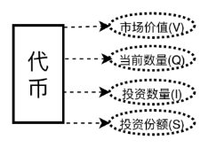


### 4.2 Token 分类

| Token 分类 | 说明 | 产生手续费 | 单独投资 | 组合投资 |
| :--- | :--- | :--- | :--- | :--- |
| **元 Token** | 协议部署时的首个 Token（如 USDT），作为价值锚定基准 | 是 | 是 | 否 |
| **价值 Token** | 市场认可度高、生态成熟的代币（如 ETH、WBTC） | 是 | 是 | 否 |
| **普通 Token** | 新增的长尾资产，需与价值 Token 配对添加 | 是 | 否 | 是 |

### 4.3 Token 配置与 Gas 优化

为了实现极致的 Gas 效率，TTSWAP 采用了**位压缩 (Bit-packing)** 技术，将代币的所有关键配置参数压缩存储在一个 256 位的存储槽 (Slot) 中。

这意味着读取或更新代币配置只需一次链上存储操作 (SSTORE/SLOAD)，大幅降低了交互成本。

*（详细的 256 位存储布局图请参见**附录 D**）*

用户可配置的参数包括：

*   **费率设置**：投资费率、撤资费率、买入/卖出费率。
*   **流动性加强倍数**：设置代币的流动性放大因子（1 ~ 市场设置的最大倍数）。
*   **撤资切片数**：用于平滑大额撤资影响的安全参数。

> **注**：市场设置的最大倍数根据代币项目质量和运营质量进行评估，默认值为 1。

## 5 元 Token 的添加

**元 Token (Meta Token)** 指协议部署后添加的首个代币，通常作为协议的价值锚定基准（如 USDT）。元 Token 本身也是一种价值 Token。

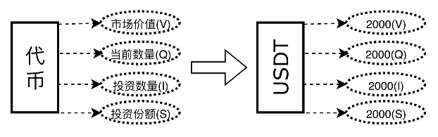

例如，协议创建者初始化 USDT 为元 Token，并注入 2,000 USDT 作为初始流动性。

*   **此时状态**：
    *   市场价值 (V) = 2,000
    *   代币数量 (Q) = 2,000
    *   投资数量 (I) = 2,000
    *   投资份额 (S) = 2,000

## 6 普通 Token 的添加

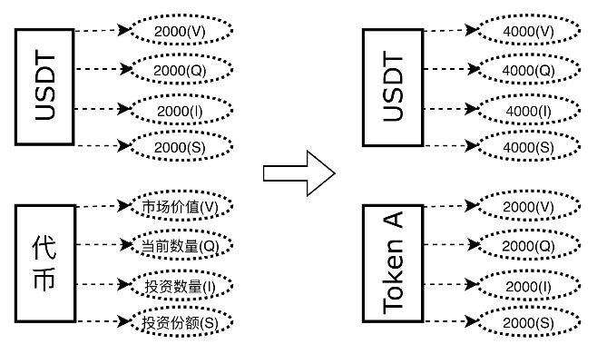

用户添加普通 Token（如 Token A）时，必须锚定一种已存在的价值 Token（如 USDT）以确定其初始定价。

假设用户添加 Token A，并锚定 USDT：

*   **USDT 状态更新**：
    *   市场价值(V) = 4,000
    *   代币数量(Q) = 4,000
    *   投资数量(I) = 4,000
    *   投资份额(S) = 4,000
*   **Token A 初始状态**：
    *   市场价值(V) = 2,000
    *   代币数量(Q) = 2,000
    *   投资数量(I) = 2,000
    *   投资份额(S) = 2,000

> **注**：广泛认可的普通代币在满足一定条件后，也可以升级为价值代币。

## 7 Token 投资与撤资

在 TTSWAP 中，提供流动性称为"投资"，移除流动性称为"撤资"。

### 7.1 核心概念


*   **Token 属性**
    *   **市场价值 (V)**：衡量代币在协议中的权重或总市场价值。
    *   **当前数量 (Q)**：协议当前持有的代币余额（包含累积的手续费）。
    *   **投资数量 (I)**：LP 存入的代币总数（包含累积的手续费）。
    *   **投资份额 (S)**：LP 持有的权益份额。公式：$\text{份额} = \text{投资数量} / \text{当前净值}$。
    *   **加强数量 (P)**：由流动性放大机制产生的虚拟流动性。

*   **投资证明 (User Proof) 属性**
    *   **投资价值 (IV)**：用户投资时刻该代币的市场价值。
    *   **持有份额 (IS)**：用户持有的投资份额。
    *   **投资数量 (IQ)**：用户投资时放大后的数量。
    *   **实际数量 (IC)**：用户实际的放大前的数量。  

### 7.2 Token 投资与撤资计算流程  

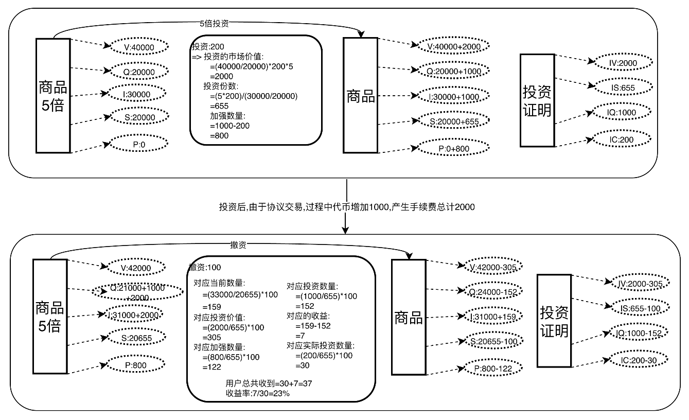

#### 7.2.1 投资 (提供流动性)
当用户投资代币时：
1.  **计算放大**：根据配置的"流动性加强倍数"，协议虚拟增加投入数量，从而在不增加实际资金占用的情况下加深市场深度。
2.  **计算份额**：根据当前资金池的净值，计算用户应得的 LP 份额。
3.  **更新状态**：增加资金池的市场价值、代币数量和总投资份额。


#### 7.2.2 撤资 (移除流动性)
当用户撤资时：
1.  **计算应还数量**：根据用户持有的份额占比，计算应赎回的代币数量。
2.  **计算收益**：$\text{收益} = \text{当前赎回数量} - \text{原始投资数量}$。
3.  **撤资切片 (Divestment Slicing)**：
    为了防止巨鲸大额撤资导致资金池瞬间枯竭或价格剧烈波动，协议引入了"撤资切片"机制，限制单次撤资的最大比例（例如不超过总池的 1/N）。如果撤资量过大，用户需分批操作或承担更高的滑点成本。

*（Token 投资与撤资详细计算流程参见**附录 E**）*

#### 7.3 抵御无常损失的三重防御机制

为了最大程度保护普通流动性提供者 (LP) 的本金安全，TTSWAP 设计了独特的三重防御体系来应对无常损失 (Impermanent Loss)：

1.  **第一道防线：协议级价值锚定 (协议级)**
    通过智能合约内置的价值守恒算法，优先保障 LP 在撤资时的本位价值，从底层逻辑上减少因价格波动带来的被动损失。

2.  **第二道防线：项目方劣后缓冲 (资金级)**
    在极端行情导致价值缺口时，代币发行方（创建者）注入的初始流动性将作为"劣后级资金"，优先承担价值波动带来的亏损，从而保护普通用户的资金安全。

3.  **第三道防线：协议代币补偿基金 (治理级)**
    作为最后的保障手段，如果上述措施仍无法覆盖全部损失，协议将启动"风险补偿机制"，通过拍卖或释放部分 TTS 治理代币筹集资金，对受损用户进行补偿。

## 8 Token 交换实例

本章演示用户用 $Token_A$ 兑换 $Token_B$ 的全过程。

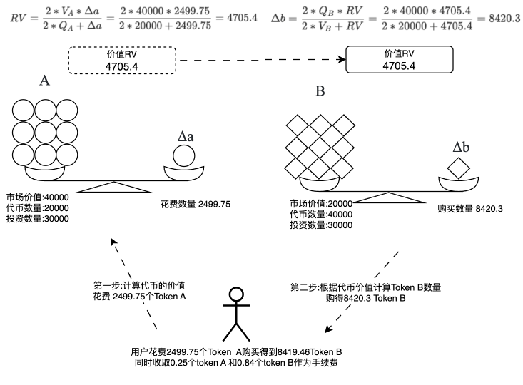

### 8.1 初始状态
*   **Token A**：价值 40,000，数量 20,000（单价 2.0）
*   **Token B**：价值 20,000，数量 40,000（单价 0.5）
*   **初始汇率**：1 Token A = 4 Token B

### 8.2 交易计算
用户输入 **2,500** 个 Token A：
1.  **扣除手续费**：假设费率 0.01%，扣除 0.25 A，实际入池 $\Delta a = 2,499.75$。
2.  **计算转移价值**：根据公式算出 $\Delta V \approx 4,705.4$。
3.  **计算输出数量**：根据 $\Delta V$ 算出 Token B 的流出量 $\Delta b \approx 8,420.3$。
4.  **扣除输出手续费**：扣除 0.84 B，用户实际收到 **8,419.46** 个 Token B。

*（Token 兑换详细计算流程参见**附录 F**）* 

### 8.3 结果分析

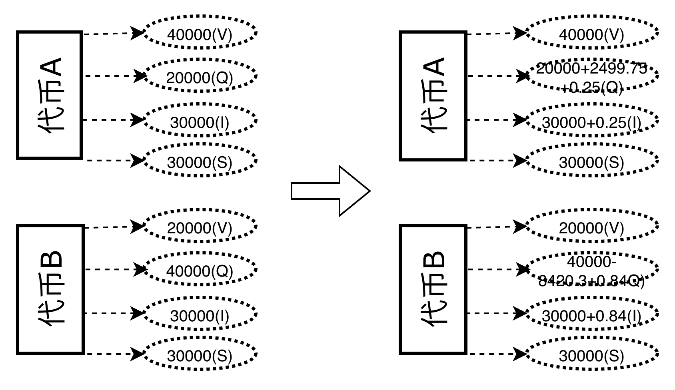

交易后，Token A 数量增加（价格下跌），Token B 数量减少（价格上涨）。协议自动完成价格发现。

### 8.4 合约安全性验证  

协议已通过多项数学一致性测试：

*   **公平性**：A 换 B，立即用 B 换回 A，除手续费外损失极小（路径无关性）。  
*（TTSWAP 模型反向兑换（闭环性）推导证明**附录 H**）*   
*   **合理性**：单笔大额交易与拆分为多笔小额交易的结果一致（无套利空间）。  
*（TTSWAP 通用模型下拆分交易的误差分析证明参见**附录 I**）*  
*   **闭环性**：A->B->C->A 的循环交易逻辑自洽。  
*（TTSWAP 循环兑换一致性证明**附录 J**）* 
  
> 参见 modified_swap_without_fee [测试合约地址](https://github.com/ttswap/ttswap-core/blob/5326e7cef7305d00fe9b909064113becc58968bd/test/modified_swap_without_fee.sol)

## 9 手续费

### 9.1 手续费来源

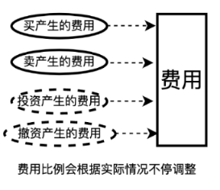

手续费在交易发生时实时扣除，并直接累积到代币的"当前数量"和"投资数量"中。这意味着 LP 份额的净值 (Net Value) 会随着交易量的增加而单调递增，在 LP 撤资时进行按角色分配。

### 9.2 分配机制

TTSWAP 采用多角色分润机制，促进生态繁荣：

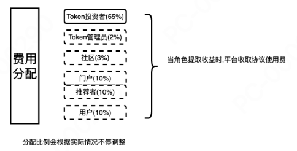  

| 角色 | 分成比例 (示例) | 说明 |
| :--- | :--- | :--- |
| **代币管理员** | 1% - 3% | 代币的初始创建者或运营方 |
| **流动性提供者 (LP)** | 50% - 80% | 核心收益者，按份额自动复利 |
| **服务提供商** | 5% - 25% | 提供前端服务、聚合交易、集成服务的第三方 |
| **推荐人** | 5% - 10% | 邀请新用户的推广大使 |
| **社区金库** | 2% - 8% | 用于回购销毁 TTS 代币或技术研发 |

若无明确推荐人，相关比例将划归服务提供商或社区金库。

*（Token 手续费与分配计算流程参见**附录 G**）*


## 10 Token 福利

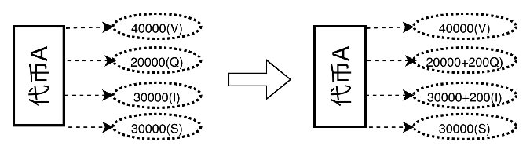

项目方可主动向资金池注入代币作为"福利"，这将直接提升 LP 份额的净值，从而提高年化收益率 (APR)，吸引更多流动性。

## 11 流动性挖矿


协议支持"投资即挖矿"机制。用户的 LP 份额会自动折算为算力，挖掘平台治理代币 TTS。这实现了双重收益：**交易手续费 + TTS 代币奖励**。

## 12 X402 支付协议支持

TTSWAP 实现了对 **X402 协议**的支持。这是一个先进的**意图导向支付标准** (Intent-Centric Payment)，类似于账户抽象 (Account Abstraction) 或 PayFi 的理念。

**核心优势**：
*   **签名与执行分离**：用户只需对支付意图进行签名（离线操作，无 Gas），而具体的上链执行、Gas 支付可由第三方"执行者" (Executor) 完成。
*   **全币种支付**：应用端无需关心用户持有何种代币，X402 协议会在链上自动完成兑换并支付目标货币。

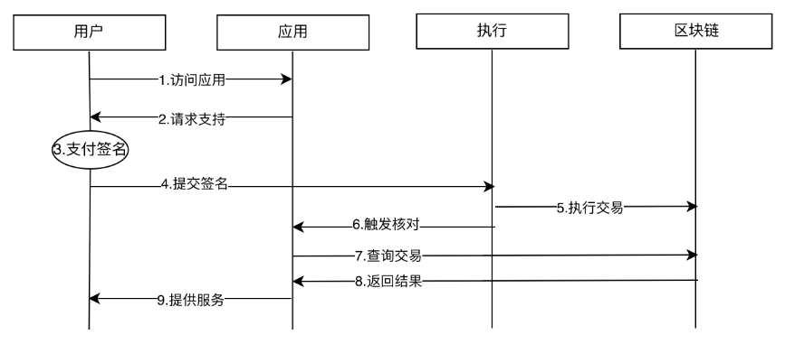

**流程**：
1.  用户访问应用，应用请求支付。
2.  用户签署离线消息 (Permit)。
3.  执行者将签名提交至链上。
4.  TTSWAP 合约验证签名，自动兑换代币并完成支付。
  
## 13 主要代码实现 (参见代码)

### 13.1 合约部署 GAS

| Deployment Cost | Deployment Size |
| --------------- | --------------- |
| 5,644,297       | 26,543          |

### 13.2 合约函数(部份主要函数)GAS

| Function Name      | avg     | 备注                 |
| ------------------ | ------- | -------------------- |
| buyGood(NativeETH) | 81,190  | 购买 Token           |
| buyGood(ERC20)     | 89,761  | 购买 Token           |
| disinvestProof     | 164,402 | 撤资                 |
| initGood           | 376,985 | 初始化 Token         |
| investGood         | 153,945 | 投资 Token           |
| goodWelfare        | 52,396  | 增加手续费发福利     |


## 14 协议中角色说明

协议中提供对于5种角色的支持，包含：代币管理员、代币流动性提供者、门户运营者、推荐者、用户、社区。

| 角色 | 收益来源 | 说明 |
| :--- | :--- | :--- |
| **流动性提供者 (LP)** | 50% - 80% | 资金池的核心贡献者，收益占比最高。 |
| **代币管理员** | 1% - 3% | 负责代币上币和参数配置的运营者。 |
| **推荐人** | 5% - 10% | 邀请新用户的推广大使。 |
| **门户运营者** | 5% - 25% | 提供前端界面、聚合交易服务的第三方。 |
| **社区金库** | 2% - 8% | 用于技术开发和回购销毁。 |
| **用户折扣** | -10% | 填写推荐码的用户可享受手续费减免。 |

## 15 代币经济方案

**TTS Token** 是协议的治理与激励代币，采用了创新的"价格导向型"解锁机制。

### 15.1 基本信息
*   **名称**：TTSWAP Token (TTS)
*   **初始发行**：5,000 万枚（全部锁定）
*   **通胀机制**：每年增发 (2 亿 - 已解锁数量) × 2% 用于奖励 LP。
*   **通缩机制**：社区收益 100% 用于二级市场回购并销毁 TTS。

### 15.2 核心创新：价格导向型解锁 (Price-Driven Unlocking)

为了防止团队砸盘和早期巨鲸抛售，TTS 的解锁与币价直接挂钩：

*   **原则**：只有币价上涨，代币才会解锁。
*   **机制**：
    *   分配时全部锁定（公售和流动性挖矿部分除外）。
    *   设定**初始价格**和**解锁比例**（例如 10%）。
    *   当币价**翻倍**时，解锁剩余锁定量的 10%。
    *   如果币价再次翻倍，再解锁剩余的 10%。
    *   **结果**：团队和早期投资者的利益与币价长期表现强制绑定。

### 15.3 4C 社区分配模型

代币分配遵循 4C 角色模型，确保贡献者获得回报：

| 角色 | 描述 | 占比 | 解锁限制 (最大) | 触发条件 |
| :--- | :--- | :--- | :--- | :--- |
| **创始人 (Founder)** | 项目发起人、承担最大风险 | 20% | < 1/20 (5%) | 需涨 1,000 倍才能解锁约 37% |
| **合伙人 (Partner)** | 核心执行团队 | 12% | < 1/14 (7.1%) | 需涨 400 倍才能解锁约 45% |
| **价值贡献 (Value)** | 社区运营、技术开发 | 44% | < 1/12 (8.3%) | 需涨 200 倍解锁约 50% |
| **资本贡献 (Capital)** | 早期投资、公售、空投 | 24% | < 1/8 (12.5%) | 需涨 100 倍解锁约 60% |


### 15.4 动态销毁 (Buyback & Burn)

*   协议产生的手续费收益中，划拨给"社区金库"的部分将全部用于**二级市场回购 TTS 并销毁**。
*   这构成了 TTS 的通缩引擎。随着交易量的增长，流通盘将持续减少，从而推升代币价值。


## 16 法律许可

### 16.1 说明  

为了维护项目合法权益，同时方便用户了解协议，不同文件采用不同的开源协议。违反协议将承担相应的法律责任。  

### 16.2 协议说明  

为了保护知识产权并促进技术交流：
*   **核心逻辑**：采用 **BUSL-1.1**（商业源使用许可）。允许学习研究，但在特定期限内限制商业分叉。
*   **外围组件**：采用 **MIT** 许可，鼓励社区开发周边工具和集成应用。

详细版权信息请查阅 GitHub 仓库中的 `LICENSE` 文件。

### 16.3 文件开源协议信息

```markdown
src
├── TTSwap_Market.sol(BUSL-1.1)  
├── TTSwap_Market_Proxy.sol(BUSL-1.1)  
├── TTSwap_Token.sol(BUSL-1.1) 
├── TTSwap_Token_Proxy.sol(BUSL-1.1)
├── interfaces  
│   ├── I_TTSwap_Market.sol(MIT)  
│   └── I_TTSwap_Token.sol(MIT)    
└── libraries           
   ├── L_Currency.sol (MIT)    
   ├── L_Error.sol (MIT)     
   ├── L_Good.sol(BUSL-1.1)    
   ├── L_GoodConfig.sol(MIT)      
   ├── L_Proof.sol(BUSL-1.1)  
   ├── L_SignatureVerification.sol(MIT)  
   ├── L_Transient.sol (MIT)  
   ├── L_TTSTokenConfig.sol (MIT)     
   ├── L_TTSwapUINT256.sol (MIT)     
   └── L_UserConfig.sol(MIT)    
docs
├── ebook
tests

```

## 17 联系方式

*   **Twitter**: [ttswapfinance](https://x.com/ttswapfinance)  
*   **Telegram**: [@ttswapfinance](https://t.me/ttswapfinance)  
*   **Email**: [bussiness@ttswap.io](mailto:bussiness@ttswap.io)  
*   **Discord**: [ttswap](https://discord.gg/XygqnmQgX3)  
*   **Website**: [ttswap.io](http://ttswap.io)   


##  附录 A: 价值守恒交易模型核心公式详细推导过程

本附录将详细展示如何从"调和平均价格"原理推导出 TTSWAP 的核心交易公式。

TTSWAP 的交易过程分为两个独立的步骤：
1.  **输入侧**：将输入的 Token A 转换为标准价值 ($\Delta V$)。
2.  **输出侧**：将标准价值 ($\Delta V$) 转换为输出的 Token B。

### 第一步：计算输入 Token A 对应的价值 $\Delta V$

我们采用**调和平均数 (Harmonic Mean)** 来确定交易的执行价格。相比算术平均，调和平均更能平滑价格波动，确保交易的公平性。

**1. 定义瞬时价值密度 (价格)**
*   **交易前状态**：
    协议持有 $Q_A$ 个 Token A，总价值为 $V_A$。
    $$ P_{start} = \frac{V_A}{Q_A} $$
*   **交易后状态 (假设)**：
    协议持有 $Q_A + \Delta a$ 个 Token A，总价值仍记为 $V_A$（以此计算边际贡献）。
    $$ P_{end} = \frac{V_A}{Q_A + \Delta a} $$

**2. 计算执行价格 (调和平均)**
对交易前后的价格取调和平均，得到本次交易的有效执行价格 $P_{exec}$：

$$
P_{exec} = \text{HarmonicMean}(P_{start}, P_{end}) = \frac{2}{\frac{1}{P_{start}} + \frac{1}{P_{end}}}
$$

代入 $P_{start}$ 和 $P_{end}$：

$$
P_{exec} = \frac{2}{\frac{Q_A}{V_A} + \frac{Q_A + \Delta a}{V_A}} = \frac{2}{\frac{2Q_A + \Delta a}{V_A}} = \frac{2 \cdot V_A}{2 \cdot Q_A + \Delta a}
$$

**3. 计算转移价值 $\Delta V$**
$$
\Delta V = P_{exec} \cdot \Delta a = \frac{2 \cdot V_A \cdot \Delta a}{2 \cdot Q_A + \Delta a}
$$

---

### 第二步：根据价值 $\Delta V$ 计算输出数量 $\Delta b$

在输出侧，我们关注的是"单位价值对应的代币数量"（即价格的倒数，记为 $D$）。

**1. 定义瞬时数量密度**
*   **交易前状态**：
    协议持有 $Q_B$ 个 Token B，总价值为 $V_B$。
    $$ D_{start} = \frac{Q_B}{V_B} $$
*   **交易后状态 (假设)**：
    总价值增加了 $\Delta V$，变成 $V_B + \Delta V$。
    $$ D_{end} = \frac{Q_B}{V_B + \Delta V} $$

**2. 计算执行密度 (调和平均)**
$$
D_{exec} = \text{HarmonicMean}(D_{start}, D_{end}) = \frac{2}{\frac{1}{D_{start}} + \frac{1}{D_{end}}}
$$

代入 $D_{start}$ 和 $D_{end}$：

$$
D_{exec} = \frac{2}{\frac{V_B}{Q_B} + \frac{V_B + \Delta V}{Q_B}} = \frac{2 \cdot Q_B}{2 \cdot V_B + \Delta V}
$$

**3. 计算输出数量 $\Delta b$**
$$
\Delta b = D_{exec} \cdot \Delta V = \frac{2 \cdot Q_B \cdot \Delta V}{2 \cdot V_B + \Delta V}
$$

至此，核心公式推导完毕。

---

##  附录 B: 价值相同情况下的公式化简 (Uniswap 等价性证明)

本附录将证明：当两个代币的权重（价值）相等时，TTSWAP 的交易模型在数学上完全等价于 Uniswap  的恒定乘积公式 (CPMM)。

### 1. 设定条件
假设 $Token_A$ 和 $Token_B$ 的配置价值相等，即：
$$ V_A = V_B = V $$

### 2. 联立公式
将附录 A 中的两步公式联立。

**输入侧**：
$$ \Delta V = \frac{2 \cdot V \cdot \Delta a}{2 \cdot Q_A + \Delta a} $$

**输出侧**：
$$ \Delta b = \frac{2 \cdot Q_B \cdot \Delta V}{2 \cdot V + \Delta V} $$

### 3. 代入与化简
将 $\Delta V$ 的表达式代入 $\Delta b$ 的公式中：

$$
\Delta b = \frac{2 \cdot Q_B \cdot (\frac{2 \cdot V \cdot \Delta a}{2 \cdot Q_A + \Delta a})}{2 \cdot V + (\frac{2 \cdot V \cdot \Delta a}{2 \cdot Q_A + \Delta a})}
$$

分子分母同时除以 $2V$：

$$
\Delta b = \frac{Q_B \cdot (\frac{2 \cdot \Delta a}{2 \cdot Q_A + \Delta a})}{1 + (\frac{\Delta a}{2 \cdot Q_A + \Delta a})}
$$

整理分母：
$$
\text{分母} = \frac{(2 \cdot Q_A + \Delta a) + \Delta a}{2 \cdot Q_A + \Delta a} = \frac{2 \cdot Q_A + 2 \cdot \Delta a}{2 \cdot Q_A + \Delta a} = \frac{2(Q_A + \Delta a)}{2 \cdot Q_A + \Delta a}
$$

将分母代回原式：

$$
\Delta b = \frac{Q_B \cdot \frac{2 \cdot \Delta a}{2 \cdot Q_A + \Delta a}}{\frac{2(Q_A + \Delta a)}{2 \cdot Q_A + \Delta a}}
$$

消去公共项 $\frac{2}{2 \cdot Q_A + \Delta a}$：

$$
\Delta b = \frac{Q_B \cdot \Delta a}{Q_A + \Delta a}
$$

### 4. 结论
上式即为 Uniswap  的标准输出公式 (忽略手续费)：
$$ \Delta y = \frac{y \cdot \Delta x}{x + \Delta x} $$

**证毕**。这表明 TTSWAP 是对 CPMM 模型的通用化扩展：在 $V_A=V_B$ 时退化为 CPMM，在 $V_A \neq V_B$ 时具备加权池特性。


## 附录 C: 价值不相同情况下的公式推导与 Balancer 等价性证明

本附录将深入分析当 $V_A \neq V_B$ 时，TTSWAP 交易模型的数学特性，并证明其在微小增量下（Spot Price）与 Balancer 加权公式的完全等价性，以及在大额交易下的高度拟合性。

### 1. Balancer 模型回顾
Balancer 采用加权恒定乘积公式 (Weighted Product Formula)：
$$ (Q_A)^{W_A} \cdot (Q_B)^{W_B} = k $$
其兑换价格 (Spot Price) 取决于储备量比率与权重比率：
$$ SP_{Balancer} = \frac{Q_B / W_B}{Q_A / W_A} \cdot \frac{1}{1 - \text{fee}} $$
(忽略手续费后，且以 A 计价 B)
$$ SP_{Balancer} = \frac{Q_A}{W_A} / \frac{Q_B}{W_B} = \frac{Q_A \cdot W_B}{Q_B \cdot W_A} $$

### 2. TTSWAP 模型的边际价格推导

我们通过对 TTSWAP 的核心公式求导来计算边际价格。

**输入侧 (Token A -> Value)**:
$$ \Delta V = \frac{2 V_A \Delta a}{2 Q_A + \Delta a} $$
当 $\Delta a \to 0$ 时 (微分视角)：
$$ dV = \lim_{\Delta a \to 0} \frac{2 V_A \Delta a}{2 Q_A} = \frac{V_A}{Q_A} da $$

**输出侧 (Value -> Token B)**:
$$ \Delta b = \frac{2 Q_B \Delta V}{2 V_B + \Delta V} $$
当 $\Delta V \to 0$ 时：
$$ db = \lim_{\Delta V \to 0} \frac{2 Q_B \Delta V}{2 V_B} = \frac{Q_B}{V_B} dV $$

**综合兑换率 (Spot Price)**:
联立上述两式：
$$ db = \frac{Q_B}{V_B} \cdot (\frac{V_A}{Q_A} da) $$
即瞬时兑换率：
$$ \frac{db}{da} = \frac{Q_B}{V_B} \cdot \frac{V_A}{Q_A} $$

因此，TTSWAP 的瞬时价格 (Spot Price) 为：
$$ SP_{TTSWAP} = \frac{da}{db} = \frac{1}{\frac{Q_B V_A}{V_B Q_A}} = \frac{Q_A V_B}{Q_B V_A} $$

### 3. 等价性对比

| 参数 | Balancer (加权池) | TTSWAP (恒定价值) |
| :--- | :--- | :--- |
| **权重定义** | 权重 $W_i$ | 市场价值 $V_i$ |
| **现货价格** | $SP = \frac{Q_A \cdot W_B}{Q_B \cdot W_A}$ | $SP = \frac{Q_A \cdot V_B}{Q_B \cdot V_A}$ |

**结论 1 (Spot Price 等价性)**：
只要我们将 TTSWAP 中的**市场价值 $V$** 视为 Balancer 中的**权重 $W$**，两者的现货价格逻辑是**完全等价**的。
即：
$$ \frac{V_A}{V_B} \iff \frac{W_A}{W_B} $$

### 4. 大额交易的曲线拟合

Balancer 的指数曲线具有恒定的弹性，而 TTSWAP 使用的是调和平均曲线 (双曲线的一种形式)。

虽然在大额交易 ($\Delta a$ 较大) 时，两者的滑点曲线会有微小差异，但数学性质高度一致：
1.  **凸性 (Convexity)**：两者都是凸函数，确保价格随着购买量的增加而增加 (滑点)。
2.  **渐近线**：两者都存在渐近线，即无法买空池子。
3.  **计算复杂度**：
    *   **Balancer**: 需要计算分数次幂 $(x^{W_A/W_B})$，链上实现复杂，消耗大量 Gas。
    *   **TTSWAP**: 仅涉及加减乘除，Gas 消耗恒定且极低。

**结论 2 (工程优势)**：
TTSWAP 在保持与加权池相同的定价逻辑 (Spot Price) 和市场深度行为的同时，通过代数近似消除了指数运算，实现了 DeFi 协议中罕见的 **O(1) 复杂度**加权交易体验。这意味着它能以 Uniswap  级别的低 Gas 费，实现 Balancer 级别的多资产组合管理能力。

## 附录 D: Token 配置存储布局

为了极致的 Gas 优化，Token 配置采用如下位压缩结构 (256 bits)：

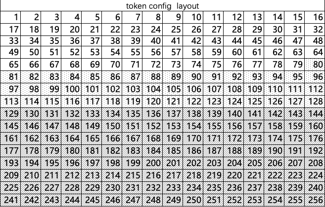

 
*   `[1-128]` 已占用，存储市场价值字段。
*   `[129-177]` 预留字段。
*   `[178-256]` 现使用配置字段。


**市场可调整区 (Admin Config)**：

| id  | 配置项             | 位数 | 单位     | 最大值 | 最小值 | 起始位 | 结束位 | 说明 |
| --- | ------------------ | ---- | -------- | ------ | ------ | ------ | ------ | ---- |
| 1   | 市场价值 Token     | 1    | BOOLEAN  | 1      | 0      | 256    | 256    |      |
| 2   | 是否冻结           | 1    | BOOLEAN  | 1      | 0      | 255    | 255    |      |
| 3   | Token 投资者分佣   | 3    | 十分之一 | 7      | 1        | 252    | 254    |      |
| 4   | 代币运营者分佣     | 4    | 百分之二 | 7      | 1         | 248    | 251    |      |
| 5   | 门户分佣           | 3    | 百分之四 | 7      | 1        | 245    | 247    |      |
| 6   | 推荐者分佣         | 5    | 百分之一 | 31     | 1         | 240    | 244    |      |
| 7   | 用户分佣           | 5    | 百分之一 | 31     | 1         | 235    | 239    |      |
| 8   | 协议费率           | 5    | 百分之一 | 31     | 1         | 230    | 234    |      |
| 9   | 最大流动性加强倍数 | 5    | 1 倍     | 31     | 1          | 225    | 229    |    (1~31)默认为1   |
| 10  | 是否申请           | 1    | 1 倍     | 1      | 1         | 224    | 224    |      |
| ... |                    |      |          |        |          |        |        |      |

> **备注**：分佣比例之和为 100%。
> 
**用户可配置区 (User Config)**：

| id  | 配置项         | 位数 | 单位     | 最大值 | 最小值 | 起始位 | 结束位 | 说明          |
| --- | -------------- | ---- | -------- | ------ | ------ | ------ | ------ | ------------- |
| 1   | 投资费率       | 6    | 万分之一 | 63     | 0      | 218    | 223    |  |
| 2   | 撤资费率       | 6    | 万分之一 | 63     | 0      | 212    | 217    |  |
| 3   | 购买费率       | 7    | 万分之一 | 127    | 0      | 205    | 211    |  |
| 4   | 出售费率       | 7    | 万分之一 | 127    | 0      | 198    | 204    | (|
| 5   | 流动性加强倍数 | 5    | 1        | 31     | 0      | 188    | 192   | (1~31)默认为1      |
| 6   | 撤资切片数     | 10   | 1        | 1023   | 0      | 178    | 187    |      |

*（注：具体位偏移可能随合约版本升级微调，以链上代码为准）*


## 附录 E: Token 投资与撤资详细计算流程

### 1. 初始状态设定

本案例旨在演示 LP 参与流动性投资与撤资的全生命周期计算。

**1.1 代币当前状态 (Token State)**
*   **市场价值 ($V$)**: 40,000
*   **当前数量 ($Q$)**: 20,000
*   **投资总数量 ($I$)**: 30,000
*   **投资总份额 ($S$)**: 20,000
*   **流动性加强倍数**: 5x（虚拟放大）

**1.2 投资证明初始状态 (User Proof)**
*   **投资价值()**: 0
*   **投资份额**: 0
*   **投资数量**: 0
*   **实际投入**: 0

---

### 2. 投资流程 (Investment)

用户决定投入 **200** 个代币参与流动性提供。

**步骤 1：计算虚拟投资数量**
根据 5 倍加强倍数，协议将用户的实际投入映射为虚拟投资量：
$$ \text{虚拟投资量} = 200 \times 5 = 1,000 $$

**步骤 2：计算投资价值**
根据当前市场价格 ($V/Q$) 锁定投资时的价值：
$$ \text{投资价值} = \frac{V}{Q} \times \text{虚拟投资量} = \frac{40,000}{20,000} \times 1,000 = 2,000 $$

**步骤 3：计算获得份额**
根据当前净值计算用户获得的 LP 份额：
$$ \text{新增份额} = \frac{\text{投资总份额}}{\text{投资总数量}} \times \text{虚拟投资量} = \frac{20,000}{30,000} \times 1,000 \approx 667 $$

**步骤 4：计算加强数量（虚拟部分）**
$$ \text{加强数量} = \text{虚拟投资量} - \text{实际投入} = 1,000 - 200 = 800 $$

**步骤 5：更新系统状态**
*   **市场价值**: $40,000 + 2,000 \rightarrow 42,000$
*   **当前数量**: $20,000 + 1,000 \rightarrow 21,000$（含虚拟增量）
*   **投资总数量**: $30,000 + 1,000 \rightarrow 31,000$
*   **投资总份额**: $20,000 + 667 \rightarrow 20,667$

**步骤 6：更新用户证明**
*   **投资价值**: 2,000
*   **投资份额**: 667
*   **投资数量**: 1,000
*   **实际投入**: 200

---

### 3. 市场变动 (State Transition)

假设一段时间后，因市场交易导致代币池状态发生变化（价格波动或手续费累积）：
*   **市场价值**: 42,000（不变）
*   **当前数量**: 21,000 $\rightarrow$ 24,000（增加）
*   **投资总数量**: 31,000 $\rightarrow$ 33,000（增加）
*   **投资总份额**: 20,667（不变）

---

### 4. 撤资流程 (Divestment)

用户决定赎回 **100** 份 LP 份额。

**步骤 1：计算当前应赎回数量**
$$ \text{当前数量} = \frac{\text{投资总数量}}{\text{投资总份额}} \times \text{赎回份额} = \frac{33,000}{20,667} \times 100 \approx 159.67 $$

**步骤 2：计算原始投资本金**
根据用户投资证明中的比例追溯原始投入：
$$ \text{原始数量} = \frac{\text{证明中投资数量}}{\text{证明中投资份额}} \times \text{赎回份额} = \frac{1,000}{667} \times 100 \approx 150 $$

**步骤 3：计算投资时的价值**
$$ \text{原始价值} = \frac{\text{证明中投资价值}}{\text{证明中投资份额}} \times \text{赎回份额} = \frac{2,000}{667} \times 100 \approx 300 $$

**步骤 4：计算净收益**
$$ \text{收益} = \text{当前数量} - \text{原始数量} = 159.67 - 150 = 9.67 $$

**步骤 5：扣除虚拟加强部分**
用户仅能提取实际资产，需扣除当初的虚拟放大额度：
$$ \text{扣除加强量} = \frac{\text{证明中加强数量}}{\text{证明中投资份额}} \times \text{赎回份额} = \frac{800}{667} \times 100 \approx 120 $$

**步骤 6：收益分配 (Fee Distribution)**
假设 LP 分成比例为 70%，其余 30% 分配给平台、推荐人等角色：
$$ \text{用户净收益} = \text{总收益} \times 70\% = 9.67 \times 0.7 \approx 6.76 $$
$$ \text{分佣扣除} = \text{总收益} \times 30\% = 9.67 \times 0.3 \approx 2.90 $$

**步骤 7：计算实际到账**
$$ \text{实际到账} = \text{当前数量} - \text{扣除加强量} - \text{分佣扣除} = 159.67 - 120 - 2.90 = 36.77 $$
*（其中包含：本金部分 $150-120=30$，净收益部分 $6.76$）*

**步骤 8：计算收益率**
$$ \text{收益率} = \frac{\text{用户净收益}}{\text{实际本金}} = \frac{6.76}{30} \approx 22.5\% $$

**步骤 9：更新系统状态**
扣除相应的市场价值、库存和份额。

**步骤 10：更新用户证明**
从用户证明中扣除已赎回的份额和对应的价值、数量记录。

> **注意**：协议设有"撤资切片 (Slicing)"保护机制。若单次撤资量超过总池的一定比例（如 1/10），交易将失败，以防止巨鲸砸盘引发市场剧烈波动。

## 附录 F: 代币兑换详细计算流程 (Token Swap)

### 1. 初始状态 (Initial State)

**1.1 Token A (输入代币)**
*   **市场价值 ($V_A$)**: 40,000
*   **当前数量 ($Q_A$)**: 20,000（单价 $P_A = 2.0$）
*   **交易手续费率**: 0.01%

**1.2 Token B (输出代币)**
*   **市场价值 ($V_B$)**: 20,000
*   **当前数量 ($Q_B$)**: 40,000（单价 $P_B = 0.5$）
*   **交易手续费率**: 0.01%


---

### 2. 交易输入计算 (Input Calculation)

用户输入 **2,500** 个 Token A 进行兑换。

**步骤 1：扣除输入手续费**
$$ \text{输入手续费} = \text{输入数量} \times \text{费率} = 2,500 \times 0.01\% = 0.25 $$
$$ \Delta a (\text{净输入}) = 2,500 - 0.25 = 2,499.75 $$

**步骤 2：计算转移价值 (Transfer Value)**
根据核心公式计算 Token A 带来的价值增量 $\Delta V$：
$$ \Delta V = \frac{2 \cdot V_A \cdot \Delta a}{2 \cdot Q_A + \Delta a} = \frac{2 \cdot 40,000 \cdot 2,499.75}{2 \cdot 20,000 + 2,499.75} \approx 4,705.4 $$

---

### 3. 交易输出计算 (Output Calculation)

**步骤 3：计算理论输出数量**
根据转移价值 $\Delta V$ 计算应输出的 Token B 数量：
$$ \Delta b_{\text{gross}} = \frac{2 \cdot Q_B \cdot \Delta V}{2 \cdot V_B + \Delta V} = \frac{2 \cdot 40,000 \cdot 4,705.4}{2 \cdot 20,000 + 4,705.4} \approx 8,420.3 $$

**步骤 4：扣除输出手续费**
$$ \text{输出手续费} = \Delta b_{\text{gross}} \times \text{费率} = 8,420.3 \times 0.01\% \approx 0.84 $$
$$ \Delta b_{\text{net}} (\text{用户实收}) = 8,420.3 - 0.84 = 8,419.46 $$

---

### 4. 交易后状态更新 (Post-Trade Update)

**4.1 Token A 更新**
*   **市场价值**: 40,000（不变）
*   **当前数量**: $20,000 + 2,499.75 + 0.25 = 22,500$
*   **投资数量**: $30,000 + 0.25 = 30,000.25$（手续费归入池内）

**4.2 Token B 更新**
*   **市场价值**: 20,000（不变）
*   **当前数量**: $40,000 - 8,420.3 + 0.84 = 31,580.54$
*   **投资数量**: $30,000 + 0.84 = 30,000.84$（手续费归入池内）

**4.3 结果分析**
*   **用户**：支付 2,500 个 Token A，获得 8,419.46 个 Token B。
*   **协议**：收取手续费 0.25 A + 0.84 B，分别累积到各自的 LP 池中，提升 LP 净值。
*   **价格影响**: 
    *   Token A 价格：$40,000 / 22,500 \approx 1.78$（下跌）
    *   Token B 价格：$20,000 / 31,580 \approx 0.63$（上涨）
    *   协议自动完成价格发现。


## 附录 G: Token 手续费详细计算与分配流程 (Fee Logic)
 

 
### 1. 手续费的产生与累积 (Accumulation)
 
**原理**：
在 TTSWAP 中，每一笔交易产生的手续费（无论是输入侧的 Token A 还是输出侧的 Token B）都会直接**保留在代币的当前数量 ($Q$) 和投资数量 ($I$) 中**，而不会改变代币的市场价值 ($V$) 或 LP 的投资份额 ($S$)。
 
**公式**：
$$ I_{new} = I_{old} + \text{Fee} $$
$$ \text{Net Value (净值)} = \frac{I + \text{Accumulated Fees}}{S} $$
 
*   随着交易量的增加，$\text{Accumulated Fees}$ 不断累积。
*   因此，**单位 LP 份额的净值**会单调递增。
 
---
 
### 2. 动态演示 (Lifecycle Demo)
 
**阶段 1：初始状态（图 1）**
*   用户尚未入场，系统内初始净值设为 1.5。
 
**阶段 2：用户投资（图 2）**
*   用户存入资金，系统根据**当前时刻的净值**计算用户获得的份额。
*   $$ S_{user} = \frac{\text{用户投资量}}{\text{当前净值}} $$
*   此时，用户持有的份额是固定的，但份额背后的价值随净值浮动。
 
**阶段 3：价值增长（图 3）**
*   随着市场交易活跃，手续费不断注入资金池。
*   **结果**：资金池的总代币数量 ($Q$) 增加，但总份额 ($S$) 保持不变（假设无存取款）。
*   **效应**：净值上升，用户手中的每一份份额现在能兑换更多的代币。
 
**阶段 4：用户撤资与分配（图 4）**
*   用户申请赎回份额。
*   **本金返还**：系统首先计算并返还用户的原始本金。
*   **收益计算**：$$ \text{总收益} = (\text{赎回份额} \times \text{当前净值}) - \text{原始本金} $$
*   **分润执行**：将计算出的总收益按照预设比例（如 LP 70%、平台 30%）进行实时分配。
 
通过这种机制，TTSWAP 实现了**自动复利**：LP 无需手动领取收益再质押，手续费直接留存在池内产生新的流动性，直到撤资时才进行结算。

# 附录 H: TTSWAP 模型反向兑换（闭环性）推导证明

本章节旨在证明 TTSWAP 价值守恒交易模型的**路径无关性**与**可逆性**。即在不考虑手续费的情况下，用户用 $\Delta a$ 个 Token A 换取 $\Delta b$ 个 Token B 后，若立即用这笔 $\Delta b$ 个 Token B 进行反向兑换，将精确换回 $\Delta a$ 个 Token A。

## 1. 初始状态设定

设系统处于初始状态 $S_0$：
*   **Token A**:
    *   价值: $V_A$
    *   数量: $Q_A$
*   **Token B**:
    *   价值: $V_B$
    *   数量: $Q_B$

---

## 2. 正向兑换：Token A $\to$ Token B

用户输入 $\Delta a$ 个 Token A。

### 2.1 计算过程
根据白皮书核心公式：

**Step 1: 计算转移价值 ($\Delta V$)**
$$
\Delta V = \frac{2 \cdot V_A \cdot \Delta a}{2 \cdot Q_A + \Delta a} \quad \text{......(公式 1)}
$$

**Step 2: 计算输出数量 ($\Delta b$)**
$$
\Delta b = \frac{2 \cdot Q_B \cdot \Delta V}{2 \cdot V_B + \Delta V} \quad \text{......(公式 2)}
$$

### 2.2 交易后状态 ($S_1$)
交易完成后，系统状态更新为：
*   **Token A**:
    *   价值: $V_A$ (不变)
    *   数量: $Q_A' = Q_A + \Delta a$
*   **Token B**:
    *   价值: $V_B$ (不变)
    *   数量: $Q_B' = Q_B - \Delta b$

---

## 3. 反向兑换：Token B $\to$ Token A

现在，我们在状态 $S_1$ 下，输入 $\Delta b$ 个 Token B，试图换回 Token A。设换回的数量为 $\Delta a_{out}$。

### 3.1 Step 1: 计算反向转移价值 ($\Delta V'$)

输入 $\Delta b$ 个 Token B。根据输入公式，分母为“交易前数量 + 输入量”。
此时 Token B 的池内数量为 $Q_B'$。

$$
\Delta V' = \frac{2 \cdot V_B \cdot \Delta b}{2 \cdot Q_B' + \Delta b}
$$

代入 $Q_B' = Q_B - \Delta b$：

$$
\Delta V' = \frac{2 \cdot V_B \cdot \Delta b}{2 \cdot (Q_B - \Delta b) + \Delta b} = \frac{2 \cdot V_B \cdot \Delta b}{2Q_B - 2\Delta b + \Delta b}
$$

$$
\Delta V' = \frac{2 \cdot V_B \cdot \Delta b}{2 \cdot Q_B - \Delta b} \quad \text{......(公式 3)}
$$

**验证 $\Delta V'$ 与 $\Delta V$ 的关系：**
由正向兑换的 (公式 2) $\Delta b = \frac{2 Q_B \Delta V}{2 V_B + \Delta V}$ 可变形为：
$$ \Delta b (2 V_B + \Delta V) = 2 Q_B \Delta V $$
$$ 2 V_B \Delta b + \Delta b \Delta V = 2 Q_B \Delta V $$
$$ 2 V_B \Delta b = \Delta V (2 Q_B - \Delta b) $$
$$ \Delta V = \frac{2 V_B \Delta b}{2 Q_B - \Delta b} $$

对比 (公式 3)，可得结论：
$$ \Delta V' = \Delta V $$
**即：正向交易产生的价值转移量，在反向全额交易时完全相等。**

### 3.2 Step 2: 计算反向输出数量 ($\Delta a_{out}$)

根据输出公式，我们使用 $\Delta V'$ (即 $\Delta V$) 从 Token A 池中换取资产。
此时 Token A 的池内数量为 $Q_A'$。

$$
\Delta a_{out} = \frac{2 \cdot Q_A' \cdot \Delta V}{2 \cdot V_A + \Delta V}
$$

代入 $Q_A' = Q_A + \Delta a$：

$$
\Delta a_{out} = \frac{2 \cdot (Q_A + \Delta a) \cdot \Delta V}{2 \cdot V_A + \Delta V} \quad \text{......(公式 4)}
$$

---

## 4. 证明 $\Delta a_{out} = \Delta a$

我们需要证明 (公式 4) 的结果等于初始输入 $\Delta a$。
即证明：
$$
\frac{2 \cdot (Q_A + \Delta a) \cdot \Delta V}{2 \cdot V_A + \Delta V} \stackrel{?}{=} \Delta a
$$

**推导：**
将等式两边同乘分母 $(2 V_A + \Delta V)$：
$$
2 (Q_A + \Delta a) \Delta V = \Delta a (2 V_A + \Delta V)
$$

展开两边：
$$
2 Q_A \Delta V + 2 \Delta a \Delta V = 2 V_A \Delta a + \Delta a \Delta V
$$

移项，将含 $\Delta V$ 的项移至左边：
$$
2 Q_A \Delta V + 2 \Delta a \Delta V - \Delta a \Delta V = 2 V_A \Delta a
$$
$$
2 Q_A \Delta V + \Delta a \Delta V = 2 V_A \Delta a
$$

提取公因式 $\Delta V$：
$$
\Delta V (2 Q_A + \Delta a) = 2 V_A \Delta a
$$

解出 $\Delta V$：
$$
\Delta V = \frac{2 \cdot V_A \cdot \Delta a}{2 \cdot Q_A + \Delta a}
$$

**结论：**
推导出的 $\Delta V$ 表达式与正向兑换时的初始定义 **(公式 1)** 完全一致。

$$
\therefore \Delta a_{out} = \Delta a
$$

## 5. 总结

通过上述代数推导证明，TTSWAP 的价值守恒模型满足数学上的闭环性（Consistency）。
*   **状态 $S_0 \xrightarrow{+\Delta a} S_1$**：Token A 增加 $\Delta a$，Token B 减少 $\Delta b$。
*   **状态 $S_1 \xrightarrow{+\Delta b} S_0$**：Token B 增加 $\Delta b$，Token A 减少 $\Delta a$。

# 附录 I: TTSWAP 通用模型下拆分交易的误差分析证明

本章节旨在证明 TTSWAP 交易模型在处理一笔大额交易 ($\Delta a$) 与将其拆分为两笔小额交易 ($\Delta a_1 + \Delta a_2$) 时的数学关系，并推导其精确误差公式。

## 1. 定义与目标

*   **初始状态**:
    *   Token A: 价值 $V_A$, 数量 $Q_A$
    *   Token B: 价值 $V_B$, 数量 $Q_B$
*   **交易量**: $\Delta a = x_1 + x_2$
*   **目标**: 计算并比较 $\Delta b_{total}$ (一次性交易) 与 $\Delta b_{split} = \Delta b_1 + \Delta b_2$ (拆分交易) 的差值。

## 2. 基础函数构建

TTSWAP 的输入输出联立公式为：
$$ \Delta b = \frac{2 Q_B V_A \Delta a}{2 V_B Q_A + (V_A + V_B) \Delta a} $$

为了简化推导，定义常数参数：
*   **$K = 2 Q_B V_A$**
*   **$M = 2 V_B Q_A$**
*   **$N = V_A + V_B$**

交易函数简化为：
$$ f(x) = \frac{K x}{M + N x} $$

---

## 3. 推导过程

### 3.1 场景 A：一次性交易 (Total)

直接代入总量 $\Delta a = x_1 + x_2$：

$$
\Delta b_{total} = \frac{K (x_1 + x_2)}{M + N (x_1 + x_2)}
$$

令分母 **$D_{total} = M + N (x_1 + x_2)$**，则：
$$ \Delta b_{total} = \frac{K (x_1 + x_2)}{D_{total}} $$

### 3.2 场景 B：拆分交易 (Split)

**第一笔交易 ($x_1$)**:
$$ \Delta b_1 = \frac{K x_1}{M + N x_1} $$
令分母 **$D_1 = M + N x_1$**，则 $\Delta b_1 = \frac{K x_1}{D_1}$。

**状态更新**:
交易后系统参数变为 $Q_A', Q_B'$，导致 $K, M$ 发生变化：
*   $M' = 2 V_B (Q_A + x_1) = M + 2 V_B x_1$
*   $K' = 2 V_A (Q_B - \Delta b_1) = K - 2 V_A \Delta b_1 = K - \frac{2 V_A K x_1}{D_1}$

**第二笔交易 ($x_2$)**:
$$ \Delta b_2 = \frac{K' x_2}{M' + N x_2} $$
代入 $K', M'$ 并化简（省略繁琐通分过程，直接给出结果）：
$$
\Delta b_2 = \frac{K x_2 [M + (V_B - V_A) x_1]}{D_1 \cdot (M + 2 V_B x_1 + N x_2)}
$$

令第二笔交易的有效分母 **$D_2 = M + 2 V_B x_1 + N x_2$**。

**拆分交易总产出**:
$$
\Delta b_{split} = \Delta b_1 + \Delta b_2 = \frac{K x_1}{D_1} + \frac{K x_2 [M + (V_B - V_A) x_1]}{D_1 D_2}
$$
通分求和后：
$$
\Delta b_{split} = \frac{K (x_1 + x_2) (M + 2 V_B x_1)}{D_1 D_2}
$$

---

## 4. 误差公式 (The Error Formula)

我们计算两者的差值：
$$ \text{Diff} = \Delta b_{total} - \Delta b_{split} $$

代入上述结果：
$$
\text{Diff} = K (x_1 + x_2) \left[ \frac{1}{D_{total}} - \frac{M + 2 V_B x_1}{D_1 D_2} \right]
$$

$$
\text{Diff} = \frac{K (x_1 + x_2)}{D_{total} D_1 D_2} \left[ D_1 D_2 - D_{total} (M + 2 V_B x_1) \right]
$$

### 4.1 核心差异项计算 (方括号内部)

我们需要计算 $\Delta_{core} = D_1 D_2 - D_{total} (M + 2 V_B x_1)$。

展开各项：
1.  $D_1 D_2 = (M + N x_1)(M + 2 V_B x_1 + N x_2)$
2.  $D_{total} (M + 2 V_B x_1) = (M + N x_1 + N x_2)(M + 2 V_B x_1)$

经过代数相减消去相同项 (过程略，详见原草稿)，剩余项为：
$$ \Delta_{core} = (N^2 - 2 V_B N) x_1 x_2 $$

代入 $N = V_A + V_B$：
$$ \Delta_{core} = [(V_A + V_B)^2 - 2 V_B (V_A + V_B)] x_1 x_2 $$
$$ \Delta_{core} = (V_A^2 - V_B^2) x_1 x_2 $$

### 4.2 最终完整公式

将 $\Delta_{core}$ 代回原式，得到精确误差公式：

$$
\text{Diff} = \frac{K \cdot (x_1 + x_2) \cdot [(V_A^2 - V_B^2) x_1 x_2]}{(M + N (x_1+x_2)) \cdot (M + N x_1) \cdot (M + 2 V_B x_1 + N x_2)}
$$

---

## 5. 结论与分析

### 5.1 路径无关性条件
*   **当 $V_A = V_B$ 时**：
    分子中的 $(V_A^2 - V_B^2) = 0$，故 $\text{Diff} = 0$。
    **结论**：此时 TTSWAP 完全等价于 Uniswap (CPMM)，交易结果与路径无关。

*   **当 $V_A \neq V_B$ 时**：
    $\text{Diff} \neq 0$，存在微小的路径依赖。
    *   $V_A > V_B$：$\text{Diff} > 0$ (一次性交易更优)
    *   $V_A < V_B$：$\text{Diff} < 0$ (拆分交易更优)

### 5.2 误差量级分析 (为什么误差极小？)

尽管分子中的核心项 $(V_A^2 - V_B^2)$ 可能很大（例如 $10^8$），但分母项的存在决定了最终误差的微小。

观察分母的量级：
$$ \text{分母} \approx M^3 = (2 V_B Q_A)^3 \approx 8 \cdot V_B^3 \cdot Q_A^3 $$

观察分子的量级：
$$ \text{分子} \approx (2 Q_B V_A) \cdot \Delta a \cdot V_A^2 \cdot (\Delta a)^2 \approx 2 \cdot Q_B \cdot V_A^3 \cdot (\Delta a)^3 $$

相对误差率近似为：
$$ \frac{\text{Diff}}{\Delta b} \approx \left( \frac{\Delta a}{Q_A} \right)^2 \cdot \frac{V_A^2 - V_B^2}{V_B^2} $$

由于单笔交易量 $\Delta a$ 通常远小于资金池深度 $Q_A$ (例如 $\Delta a / Q_A \approx 0.001$)，其平方项 ($10^{-6}$) 会极大地缩小误差。

**数值示例**：
若代入 $V_A=10000, Q_A=10000, V_B=100, Q_B=100, \Delta a=2$：
*   核心差异项 $\approx 10^8$
*   分母 $\approx 10^{18}$
*   最终误差 $\approx 10^{-5}$

这证明了 TTSWAP 在获得 Balancer 级加权特性的同时，通过代数近似，仅引入了工程上可忽略不计的微小误差，换取了巨大的 Gas 优势。

# 附录 J: TTSWAP 循环兑换一致性证明 (三角闭环)

本章节旨在证明 TTSWAP 价值守恒交易模型的**多跳路径闭环性**。即在不考虑手续费的情况下，用户进行 $A \to B \to C \to A$ 的循环交易后，最终获得的 Token A 数量等于初始投入数量。

$$ \Delta a_{final} = \Delta a_{initial} $$

## 1. 初始状态设定

设系统中有三个代币池，初始状态如下：

1.  **Token A**: 价值 $V_A$, 数量 $Q_A$
2.  **Token B**: 价值 $V_B$, 数量 $Q_B$
3.  **Token C**: 价值 $V_C$, 数量 $Q_C$

---

## 2. 第一跳：Token A $\to$ Token B

用户输入 $\Delta a$ 个 Token A。

### 2.1 计算过程
根据 TTSWAP 核心公式：

$$
\Delta V_{AB} = \frac{2 \cdot V_A \cdot \Delta a}{2 \cdot Q_A + \Delta a}
$$

$$
\Delta b = \frac{2 \cdot Q_B \cdot \Delta V_{AB}}{2 \cdot V_B + \Delta V_{AB}}
$$

### 2.2 状态更新 ($S_1$)
*   $Q_A' = Q_A + \Delta a$
*   $Q_B' = Q_B - \Delta b$
*   Token C 状态不变。

---

## 3. 第二跳：Token B $\to$ Token C

用户使用第一跳获得的 $\Delta b$ 个 Token B 进行兑换。

### 3.1 计算过程
输入量为 $\Delta b$。根据公式，我们先计算 Token B 带来的价值转移量 $\Delta V_{BC}$。
注意此时 Token B 的池内数量为 $Q_B'$。

$$
\Delta V_{BC} = \frac{2 \cdot V_B \cdot \Delta b}{2 \cdot Q_B' + \Delta b}
$$

代入 $Q_B' = Q_B - \Delta b$：
$$
\Delta V_{BC} = \frac{2 \cdot V_B \cdot \Delta b}{2(Q_B - \Delta b) + \Delta b} = \frac{2 \cdot V_B \cdot \Delta b}{2 Q_B - \Delta b}
$$

**关键引理：价值传递守恒**
回顾第一跳中 $\Delta b$ 的公式：
$$ \Delta b = \frac{2 Q_B \Delta V_{AB}}{2 V_B + \Delta V_{AB}} $$
变形可得：
$$ \Delta b (2 V_B + \Delta V_{AB}) = 2 Q_B \Delta V_{AB} $$
$$ 2 V_B \Delta b = \Delta V_{AB} (2 Q_B - \Delta b) $$
$$ \Delta V_{AB} = \frac{2 V_B \Delta b}{2 Q_B - \Delta b} $$

对比 $\Delta V_{BC}$ 的表达式，可得：
$$ \Delta V_{BC} = \Delta V_{AB} $$

**物理含义**：Token A 带来的价值量 ($\Delta V_{AB}$) 在转化为 Token B 数量 ($\Delta b$) 后，若将这笔 Token B 全额投入下一跳，其携带的价值量 ($\Delta V_{BC}$) 完全等于初始价值量。
令 $\Delta V = \Delta V_{AB} = \Delta V_{BC}$。

**计算输出 $\Delta c$**：
$$
\Delta c = \frac{2 \cdot Q_C \cdot \Delta V}{2 \cdot V_C + \Delta V}
$$

### 3.2 状态更新 ($S_2$)
*   $Q_B'' = Q_B' + \Delta b = (Q_B - \Delta b) + \Delta b = Q_B$ (**Token B 池恢复初始状态**)
*   $Q_C' = Q_C - \Delta c$

---

## 4. 第三跳：Token C $\to$ Token A

用户使用第二跳获得的 $\Delta c$ 个 Token C 换回 Token A。

### 4.1 计算过程
输入量为 $\Delta c$。计算价值转移量 $\Delta V_{CA}$。
此时 Token C 的池内数量为 $Q_C'$。

$$
\Delta V_{CA} = \frac{2 \cdot V_C \cdot \Delta c}{2 \cdot Q_C' + \Delta c}
$$

代入 $Q_C' = Q_C - \Delta c$：
$$
\Delta V_{CA} = \frac{2 \cdot V_C \cdot \Delta c}{2 Q_C - \Delta c}
$$

同样利用之前的引理（形式相同），由 $\Delta c = \frac{2 Q_C \Delta V}{2 V_C + \Delta V}$ 可反推导出：
$$ \Delta V = \frac{2 V_C \Delta c}{2 Q_C - \Delta c} $$

因此：
$$ \Delta V_{CA} = \Delta V $$

**价值量再次守恒**：这表明资金流转一圈回到 Token A 池前，携带的“购买力价值”仍然是最初产生的 $\Delta V$。

**计算最终输出 $\Delta a_{final}$**：
此时 Token A 的池内数量为 $Q_A'$ (第一跳增加后的数量)。
$$ Q_A' = Q_A + \Delta a $$

我们使用 $\Delta V$ 从 Token A 池中换出资产：
$$
\Delta a_{final} = \frac{2 \cdot Q_A' \cdot \Delta V}{2 \cdot V_A + \Delta V}
$$

代入 $Q_A'$：
$$
\Delta a_{final} = \frac{2 \cdot (Q_A + \Delta a) \cdot \Delta V}{2 \cdot V_A + \Delta V}
$$

### 4.2 证明 $\Delta a_{final} = \Delta a$

我们需要验证：
$$ \frac{2 (Q_A + \Delta a) \Delta V}{2 V_A + \Delta V} \stackrel{?}{=} \Delta a $$

回顾第一跳中 $\Delta V$ 的定义：
$$ \Delta V = \frac{2 V_A \Delta a}{2 Q_A + \Delta a} $$
变形得：
$$ \Delta V (2 Q_A + \Delta a) = 2 V_A \Delta a $$

现在看 $\Delta a_{final}$ 的分子：
$$ 2 (Q_A + \Delta a) \Delta V = 2 \Delta V Q_A + 2 \Delta V \Delta a $$
这似乎不是最简路径。我们采用更直接的代数变换。

**目标等式**：
$$ \Delta a_{final} = \Delta a $$
$$ \Updownarrow $$
$$ \frac{2 (Q_A + \Delta a) \Delta V}{2 V_A + \Delta V} = \Delta a $$
两边同乘分母：
$$ 2 (Q_A + \Delta a) \Delta V = \Delta a (2 V_A + \Delta V) $$
展开：
$$ 2 Q_A \Delta V + 2 \Delta a \Delta V = 2 V_A \Delta a + \Delta a \Delta V $$
移项整理：
$$ 2 Q_A \Delta V + \Delta a \Delta V = 2 V_A \Delta a $$
提取 $\Delta V$：
$$ \Delta V (2 Q_A + \Delta a) = 2 V_A \Delta a $$
$$ \Delta V = \frac{2 V_A \Delta a}{2 Q_A + \Delta a} $$

这正是我们出发时的定义式。等式成立。

## 5. 结论

**证毕**。

通过数学推导证明：
1.  **价值传递守恒**：在中间环节（Token B 和 Token C），输入代币产生的价值增量 $\Delta V$，在全额兑换后，能够无损地传递到下一个环节。
2.  **闭环无损**：最终换回的 Token A 数量 $\Delta a_{final}$ 严格等于初始投入 $\Delta a$。
3.  **状态复原**：交易完成后，Token B 和 Token C 的池内数量恢复初始值，Token A 池内数量先增后减也恢复初始值。系统整体状态完全回滚。

这证明了 TTSWAP 模型在多跳循环交易中具备严格的数学闭环性，不存在无风险套利机会。